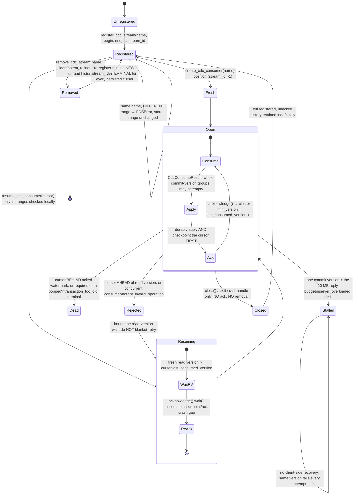

# FoundationDB native CDC, deep dive

Source-read only, 2026-09-09. No cluster contacted, no binding imported, no probe run. Nothing here
carries ⚑LIVE.

## TL;DR

| # | Deliverable | The answer | |
|---|---|---|---|
| 1 | Stream lifecycle | `register_cdc_stream` → `create_cdc_consumer` (or `resume_cdc_consumer` from a persisted cursor) → `consume` → durably apply **and checkpoint** → `acknowledge` → `close`. `close()` neither acks nor removes. Removal is terminal. Re-registering the name mints a new `stream_id`, killing every persisted cursor that names the old one. | [§1](#1-cdc-stream-lifecycle-deliverable-1) |
| 2 | Python API | Five future-returning `Database` methods (`register_cdc_stream`, `remove_cdc_stream`, `list_cdc_streams`, `create_cdc_consumer`, `resume_cdc_consumer`), plus a `CdcConsumer` handle with `consume` / `acknowledge` (futures) and `get_position` / `close` (synchronous). Five value types, one non-exhaustive enum. `consume()` and `acknowledge()` take no arguments. No `asyncio`. All of it prospective on unmerged PR #13925. | [§2](#2-python-api-deliverable-2) |
| 3 | Limitations | At-least-once only. One oversized commit version stalls a stream permanently (`server_overloaded`, and no way to skip the version). No error mapping shipped, and the standard retry predicate is wrong about two of the three CDC error codes. Unacked streams retain TLog history with no age bound. **P1: #13925 and #13971 redefine the same symbols at the same API version, undetectable at load.** | [§3](#3-known-limitations-and-gaps-deliverable-3) |
| 4 | API version | API 800, hard-gated, raising synchronously below it. Selecting 800 also removes tenants and metaclusters, blob granules, ChangeFeed, storage cache servers, the configuration database and dynamic knobs, and encryption at rest. No released FDB has CDC. 7.4.7 has zero CDC symbols, and 8.0.0 is unreleased with no date. | [§4](#4-api-version-requirements-deliverable-4) |

## How to read this

Ninety seconds: the table above, the state diagram in [§1.1](#11-the-state-machine-), the reference
table in [§2.1](#21-reference-table-), and the ranked limitations table in
[§3](#3-known-limitations-and-gaps-deliverable-3). That is the whole ticket.

Headings are marked ▲ must-read (you will get this wrong if you skip it) or ▽ skim (reference). Each
section opens with a one-line takeaway. The takeaways alone give the claims without the evidence.
Appendices hold derivations only.

## 0. Read this first ▲

### Pins

| Ref | SHA | Meaning |
|---|---|---|
| `../foundationdb` | `c50931feb` | the pin. 8.0.0, API 800 (`CMakeLists.txt:27`, `flow/ApiVersions.cmake:2`) |
| `upstream/main` | `b870261ee` | upstream head when read |
| PR #13925 (`pr13925`) | `ee1fa01e6` | Python CDC bindings. Open, `mergeable_state: dirty` |
| PR #13971 (`pr13971`) | `c7fb905dc` | multi-range CDC streams. Open, `mergeable_state: dirty` |

### Four premise corrections

The ticket got four things wrong, and one of them cannot be worked around.

1. **CDC is not in FoundationDB 7.4.7.** Zero CDC symbols
   (`git show 7.4.7:bindings/c/foundationdb/fdb_c.h | grep -ci cdc` → 0). `release-7.4` is now
   `VERSION 7.4.8`, still without CDC. The ticket's 7.4.7 doc-tree citation cannot be satisfied.
2. **The feature did not land via #13925 or #13971.** CDC landed on `main` via #13287 (feature) and
   #13674 (C bindings). #13925 is the *Python* follow-up, #13971 the *multi-range* follow-up. Neither
   merged, neither in the pin.
3. **`register_stream()` and `ack()` do not exist.** Real names in TL;DR row 2 and §2.1
   (`impl.py:1424-1485`, `:1586-1605` @ `ee1fa01e6`).
4. **A directory's CDC range is `[rawPrefix, strinc(rawPrefix))`, not `dir.range()`.** Different
   ranges, silent difference, permanent registration. Rule in
   [§2.5](#25-registering-a-directorys-range-). The `Proposal.md` sample predates it.

### Verified vs prospective

The C API, server implementation, API-version constant and `ENABLE_NATIVE_CDC` knob all come from the
pin. Two things sit outside it, marked as such wherever they appear.

- **PR #13925** covers all of §2 and most of §1. Prospective on it landing as written. Build against
  it anyway, since the CDC feature author wrote it and CI is green, but it is not a released contract,
  and the P1 ABI conflict (L2 in §3) puts its shape at risk.
- **`release-notes-800.rst`** is the source for §4.2's removal table. Added by `a7887284c` after the
  pin, on `upstream/main` only, and titled a draft.

---

## 1. CDC stream lifecycle (deliverable 1)

> In one line: register, consume, checkpoint, acknowledge, close. The ack order is not negotiable and
> removal is terminal.

Server behaviour is cited to the pin, Python names to #13925 @ `ee1fa01e6`.

### 1.1 The state machine ▲



> **Signature risk.** The first edge is the least stable thing here. PR #13971 (`c7fb905dc`, open)
> replaces the C signature with `(name, name_length, ranges, range_count)` under the *same* symbol at
> the *same* API version, no `_v2` (`13971.diff:50-68`, `:87-94`). See L2 in §3.

### 1.2 Who holds what state ▽

| Lives where | What | Source |
|---|---|---|
| Cluster (transaction state) | `\xff/cdc/name/<name>` → `CDCStreamId`; `\xff/cdc/maxStreamId` (monotonic allocation); `\xff/cdc/keys/<streamId>` → the **immutable** `KeyRange`; `\xff/cdc/tagHistory/<streamId>/<version>/<tag>` | `design/cdc.md:335-343` |
| Cluster (storage-backed) | `\xff\x02/cdc/minVersion/<streamId>` → `Version`, the retention watermark. Versionstamped at registration, advances to `V+1` on ack | `design/cdc.md:356-371` |
| Client handle (in memory) | `CdcConsumer`, an owned native handle, not a `Future`. Its only client-visible state is the delivered position, via `get_position()` | `impl.py:1547-1615` |
| **Your application (durable)** | `CdcCursor(stream_id, last_consumed_version)`, which "contains no process-local state". `resume_cdc_consumer` never reads the acked position back from the cluster; it rebuilds the handle from those two ints | `13925.diff:1048`; `impl.py:1465-1480` |

`min_version` reaches the client only via `list_cdc_streams()`, and it is "a retention frontier, not a
snapshot version for the registered key range" (`13925.diff:1077-1078`). Never a read version.
Retention releases per CDC *tag*, at `safePop(T) = min(minVersion(S))` over every live stream sharing
the tag, so a slow sibling stream pins your history too (`design/cdc.md:591-594`).

### 1.3 Acknowledgement semantics ▲

> In one line: `acknowledge()` is a cumulative durable watermark, takes no argument, and is atomic
> with nothing.

`acknowledge()` returns `FutureVoid` and acks whatever `get_position()` would return, the
`last_consumed_version` of the last successful `consume()`. No per-record ack, no ack-by-version
(`impl.py:1598-1605`). It advances cluster `minVersion` to `V + 1` (`design/cdc.md:369-371`;
`native_cdc_tests.py:286-287`), releasing history through it. Re-acking a durable position moves
nothing (`native_cdc_tests.py:281-287`). It is "not atomic with writes to a downstream system or an
application checkpoint" (`13925.diff:1139-1140`), and CDC methods are not on `Transaction`, so
`@fdb.transactional` cannot make them so (`13925.diff:1004-1006`).

**Why the order is not negotiable.** Acking before you have durably applied *and* checkpointed turns
a crash into data loss. The ack releases TLog history through that version and the un-checkpointed
work cannot be replayed. Checkpointing first turns a crash into duplicate delivery instead, which you
must tolerate regardless, since "unacknowledged mutations may be redelivered after CDC proxy
replacement" (`13925.diff:1058-1059`).

Do this even when the reply is empty. "Even an empty reply can advance the cursor", so never skip the
checkpoint because `mutations` is empty (`13925.diff:1110-1113`). Empty replies are the norm.
`consume()` is a long poll over a bounded `CDC_PROXY_CONSUME_POLL_TIMEOUT` lease (5.0 s,
`fdbserver/core/ServerKnobs.cpp:186`).

`close()` releases the handle and acknowledges nothing. `min_version` is unchanged across a close
(`impl.py:1570-1576`, `native_cdc_tests.py:257-258`).

### 1.4 Resuming after a crash ▲

> In one line: the `Resuming` box is mandatory, not defensive. `resume_cdc_consumer` validates almost
> nothing and a resumed handle carries no delivery proof.

`resume_cdc_consumer(cursor)` checks only that `stream_id` is in `[0, 2**64)` and
`last_consumed_version` in `[-2**63, 2**63)`, raising `ValueError` otherwise and `TypeError` for
non-ints (`impl.py:1465-1480`). "Stream existence and cursor validity are checked when consuming or
acknowledging, not by this method" (`13925.diff:1049-1051`). `get_position()` echoes the cursor until
the first consume (`native_cdc_tests.py:267`).

So resume only from a durably processed checkpoint, wait for a fresh read version to reach
`cursor.last_consumed_version`, then reissue `acknowledge()` and wait on it. That closes the crash
window between persisting the checkpoint and completing its acknowledgement (`13925.diff:1193-1195`).
A resumed handle "lacks the original handle's delivery proof", so a cursor ahead of that read version
draws `client_invalid_operation` even if the data was previously delivered. Upstream is explicit:
"bound the read-version wait rather than retrying all invalid-operation errors"
(`13925.diff:1050-1058`; proxy check at `fdbserver/cdcproxy/CDCProxy.cpp:1527-1535`).

The other direction is `transaction_too_old`. Either the cursor is behind the already-acked
watermark, or the required tagged data was popped, and the latter "indicat[es] a retention invariant
violation rather than a supported expiration policy" (`design/cdc.md:282-286`;
`CDCProxy.cpp:1504-1506`). Both are terminal, and the native client does not retry them
(`design/cdc.md:288-291`).

### 1.5 Removal, retention, and admission ▽

- **Removal is terminal.** Re-registering the name "does not redirect their cursors to the new
  stream" (`13925.diff:1033-1034`). It allocates a fresh id from `\xff/cdc/maxStreamId`, so every
  persisted `CdcCursor` naming the old id is dead. `remove_cdc_stream` is idempotent
  (`native_cdc_tests.py:311-312`).
- **The range is immutable for the life of a `stream_id`.** Changing one means remove plus
  re-register (`native_cdc_tests.py:317-323`; non-goal at `design/cdc.md:84-85`).
- **An abandoned stream costs disk forever.** L3 in §3. A cluster-level hazard, not a consumer-local
  one.
- **Admission.** Registering a *new* stream requires `ENABLE_NATIVE_CDC` on the server processes
  (§4.3). With it disabled, listing, removal, consumer creation, resume, consumption and
  acknowledgement keep working (`design/cdc.md:709-713`). Upstream advises "Register long-lived
  streams rather than a stream per request" (`13925.diff:1027`).

---
## 2. Python API (deliverable 2)

> In one line: five `Database` methods, one consumer handle, five value types and one non-exhaustive
> enum, all prospective on #13925.

Prospective, source-read, not observed: apple/foundationdb PR #13925 (head `ee1fa01e6`), open and
unmerged. #13971 breaks two signatures ([§2.6](#26-below-the-api-and-the-13971-break-)).

### 2.1 Reference table ▲

Five methods on `Database` (`13925.diff:162-222`), five on `CdcConsumer` (`13925.diff:296-356`), none
on `Transaction` or `Tenant`, which "cannot be made atomic with application writes by using
`transactional`" (`13925.diff:1004-1006`). No defaults, type annotations, options, limits or timeouts.

| Call | Parameters | Returns | Resolved value | Sync? |
|---|---|---|---|---|
| `Database.register_cdc_stream` | `name, begin_key, end_key`, all `bytes` | `FutureUInt64` | `int` stream id (unsigned 64-bit) | future |
| `Database.remove_cdc_stream` | `name: bytes` | `FutureVoid` | `None`, idempotent (`tests:311-312`) | future |
| `Database.list_cdc_streams` | none | `FutureCdcStreamInfoArray` | `list[CdcStreamInfo]` | future |
| `Database.create_cdc_consumer` | `name: bytes` | `FutureCdcConsumer` | `CdcConsumer` | future |
| `Database.resume_cdc_consumer` | `cursor: CdcCursor` | `FutureCdcConsumer` | `CdcConsumer` | future |
| `CdcConsumer.consume` | none | `FutureCdcConsumeResult` | `CdcConsumeResult` | future (long poll) |
| `CdcConsumer.acknowledge` | none, no token, no version | `FutureVoid` | `None` | future |
| `CdcConsumer.get_position` | none | | `CdcCursor` | synchronous |
| `CdcConsumer.close` | none | | `None`, idempotent | synchronous |
| `CdcConsumer.__enter__` / `__exit__` | context manager | | `self` / `None` | synchronous |

Errors:

| Raised | When |
|---|---|
| `RuntimeError("Native CDC requires API version 800 or later")`, or, at API 800 with a `libfdb_c` lacking the experimental symbols, `RuntimeError("The loaded FoundationDB C library does not support native CDC")` `from AttributeError` | first statement of all five `Database` methods, before coercion and before any future exists (`13925.diff:164, 182, 190, 197, 209`) |
| `TypeError("Key must be of type bytes")` | key args via `keyToBytes()`, so `str` or anything without `as_foundationdb_key()` (**pin** `impl.py:1525-1530`; call sites `13925.diff:165-167, 183, 198`) |
| `ValueError` | `resume_cdc_consumer` range-checks both cursor fields via `operator.index()` (`13925.diff:210-217`; `tests:347-368`) |
| `ValueError("CDC consumer is closed")` | `consume`/`acknowledge`/`get_position` after `close()` (`13925.diff:304-354`) |
| `fdb.FDBError` **from the future, not the call** | all native errors: bad name, range conflict, missing stream (`tests:317-323`) |

- One `consume` or `acknowledge` outstanding per handle. Acks affect the whole stream, and `close()`
  neither acks nor removes it (`13925.diff:288-295`).
- `FutureCdcConsumer.wait()` memoizes its `CdcConsumer` under a lock. Each C getter transfers a
  reference, so repeated `wait()`/`result()` return one identical object (`13925.diff:104-123`;
  `tests:221-223`).
- Only the `Database` methods are gated. The seven `Cdc*` names export at any API version, covered by
  a CI job at `--api-version 740` (`13925.diff:5-19`).

### 2.2 Value types ▽

Immutable `NamedTuple`s plus one `IntEnum` (`13925.diff:228-286`).

| Type | Fields |
|---|---|
| `CdcCursor` | `stream_id: int`, `last_consumed_version: int` |
| `CdcStreamInfo` | `name: bytes`, `stream_id: int`, `begin_key: bytes`, `end_key: bytes`, `min_version: int` |
| `CdcMutation` | `type: int`, `param1: bytes`, `param2: bytes` |
| `CdcVersionedMutations` | `version: int` (commit version, C `int64_t`), `mutations: Tuple[CdcMutation, ...]`, may be empty |
| `CdcConsumeResult` | `mutations: Tuple[CdcVersionedMutations, ...]`, one entry per commit version; `last_consumed_version: int`, the watermark *after* this reply |

`CdcMutationType(enum.IntEnum)` has sixteen values, mirroring `MutationRef::Type`:

```
SET_VALUE=0 CLEAR_RANGE=1 ADD=2 AND=6 OR=7 XOR=8 APPEND_IF_FITS=9 MAX=12 MIN=13
SET_VERSIONSTAMPED_KEY=14 SET_VERSIONSTAMPED_VALUE=15 BYTE_MIN=16 BYTE_MAX=17
MIN_V2=18 AND_V2=19 COMPARE_AND_CLEAR=20
```

**Never call `CdcMutationType(code)` unguarded.** `CdcMutation.type` is a plain `int` (`tests:117`),
code `255` round-trips (`tests:68, 108`), and callers must "handle an unrecognized raw `uint8_t`
value" (`api-c.rst:583-584`).

### 2.3 What a mutation record is ▲

Nesting is `CdcConsumeResult` → `CdcVersionedMutations` → `CdcMutation` (§2.2,
`13925.diff:124-153`). `param1`/`param2` are Python-owned `bytes` copied with `ctypes.string_at`,
independent of the native arena (`tests:96-117`), and a null pointer of length 0 decodes to `b""`
(`tests:74`). Per type (`13925.diff:1064-1071`): `SET_VALUE` gives key and value, `CLEAR_RANGE` gives
begin and end clipped to the registered range, atomic ops give key and operand. Raw operations, never
a materialized post-mutation value.

**A record's identity is `(version, array index)` and nothing else.** No timestamp, transaction id or
boundary, sequence number or proxy id appears in any of the twelve CDC declarations at
`fdb_c.h:400-467`. One commit version covers a whole commit batch, so several transactions' mutations
share a version, inseparably. Intra-version order is tuple order, but upstream asserts it only
order-insensitively (`assertCountEqual`, `tests:243, 299`).

**Which types can appear.** CDC delivers committed effects, so three groups never reach a consumer:

- **3-5, 10, 11, 21-23** (`Debug*`, `NoOp`, `AvailableForReuse`, `Reserved_For_*Message`) are
  server-internal or reserved, and the C enum omits them (`CommitTransaction.h:70-96`,
  `fdb_c.h:194-212`).
- **14/15 `SET_VERSIONSTAMPED_*`** are declared but dead on the wire, rewritten to `SetValue` before
  CDC tagging (§3, *Mutation fidelity*).
- **6 `AND`, 13 `MIN`** are rewritten client-side to `AND_V2`/`MIN_V2` above API 510, so only a
  separate legacy client at API < 510 could emit them.

Replies carry complete commit-version groups only, which callers must "preserve"
(`13925.diff:1100-1104`). `consume()` takes no arguments, so there is no row or byte limit, no
caller-settable timeout, and no streaming mode. An empty reply is legal and still advances the cursor
(`tests:121-131`). There is no end-of-stream marker.

### 2.4 Usage, illustrative and untested ▲

From the upstream doc example (`13925.diff:1160-1191`), exercised by `tests:202-315`.

```python
fdb.api_version(800)
db = fdb.open()

stream_id = db.register_cdc_stream(b"orders", b"/orders/", b"/orders0").wait()

with db.create_cdc_consumer(b"orders").wait() as consumer:
    while True:
        reply = consumer.consume().wait()     # whole version groups; may be empty
        for group in reply.mutations:
            for m in group.mutations:
                # m.type is a plain int; the enum is non-exhaustive
                apply_downstream(group.version, m.type, m.param1, m.param2)

        checkpoint(consumer.get_position())   # 1. effects + cursor durable together
        consumer.acknowledge().wait()         # 2. only then release retention
```

That ordering is the point. §1.3 carries the argument.

### 2.5 Registering a directory's range ▲

**Register `[rawPrefix, strinc(rawPrefix))`, never `dir.range()`.** `register_cdc_stream` takes raw
begin/end bytes, but `Subspace.range()` is `[rawPrefix + b"\x00", rawPrefix + b"\xff")`
(`subspace_impl.py:51-53` over `tuple.py:536-537`), which drops the bare prefix key and any
`rawPrefix + b"\xff"…` key. Every tuple-packed key falls inside `dir.range()`, so the two look
equivalent until someone writes a raw-suffix or empty-tuple key. By then the registration is durable
and immutable, and that mutation is silently invisible. `validateNativeCdcStream`
(`fdbclient/NativeCdc.cpp:98-102`) rejects only an empty name, an empty range, or a range outside
`normalKeys`, not prefix alignment.

`strinc` is not exported from `fdb`; it is `fdb.impl.strinc` (**pin** `impl.py:2162-2166`). Nor is a
directory's prefix contractually stable. A `move` changes nothing about an already-registered range,
and `developer-guide.rst:141-216` promises nothing either way.

### 2.6 Below the API, and the #13971 break ▽

#13925 adds no C code. It prototypes twelve existing `fdb_c.h` symbols lazily on first CDC use, so a
`libfdb_c` at API 800 without them still serves non-CDC callers (`13925.diff:428-431`;
`tests:325-345`). Struct layout: [Appendix A](#appendix-a-abi-layout-receipt-).

**The signatures in §2.1 will not survive #13971 unchanged.** It replaces
`fdb_database_register_cdc_stream`'s four trailing key parameters with
`(FDBKeyRange const* ranges, int range_count)` and swaps `FDBCdcStreamInfo`'s `key_range` for `ranges`
plus `range_count` (52 bytes down to 40), under the same symbol names at the same API 800
(`13971.diff:77-95`), while touching zero files under `bindings/python`
(`grep -c bindings/python 13971.diff` → 0). Landed as written, `register_cdc_stream` would pass seven
C arguments to a five-argument function and `CdcStreamInfo.begin_key`/`.end_key` would read a layout
that no longer exists. Expect `register_cdc_stream(name, ranges)` and `CdcStreamInfo.ranges`
post-merge. Until then §2.1 is the #13925-only contract. Full analysis: L2 in §3.

---
## 3. Known limitations and gaps (deliverable 3)

> In one line: one range, one consumer, at-least-once, no error mapping, unbounded retention, plus
> one poison pill and one P1.

Three of these can stop the project: L1, L2, L3. L5 and below are constraints to design around, not
risks to plan against. Rows marked prospective depend on a named open PR and describe no shipped
artifact.

| # | Limitation | Consequence for a Kafka bridge | Status | Evidence |
|---|---|---|---|---|
| **L1** | One commit version whose CDC mutations exceed the consume-reply budget (`CDC_PROXY_CONSUME_REPLY_BYTES`, 10 MB) throws `server_overloaded` (1211) at that version on every attempt. Buffer-limit trips set a per-stream flag initialised `false` and never cleared. | Permanent stall. One fat transaction wedges the stream at a fixed version, with no way to skip the version and no forward progress, and the flag survives until the proxy is replaced or the stream re-initialised. `server_overloaded` is not in the retryable predicate, so it arrives raw and a naive loop spins. | Pin | `CDCProxy.cpp:1583-1590` (`firstVersionTooLarge` → `throw server_overloaded()`); flag `:82`, set `:631`/`:652`/`:964`, read `:740`/`:1480`/`:1556`, never cleared; `fdbserver/core/ServerKnobs.cpp:179` |
| **L2** | #13925 and #13971 redefine the same exported symbols at the same API version, with no `_v2` and no version guard. `fdb_database_register_cdc_stream` goes 7 args to 5. `FDBCdcStreamInfo` goes 52 bytes to 40, so `CdcStreamInfo.begin_key`/`.end_key` (§2.2) cease to exist as fields. The value-type break is as bad as the signature break. | Silent memory corruption, both directions. `dlsym` resolves by name and succeeds, so nothing fails at load. See *ABI risk* below. | **Prospective**, both PRs open | `13971.diff:77-95`; `impl.py:1424-1440` @ `ee1fa01e6`; `mengxu_review.md`, review 5074513231 |
| **L3** | Retention is released only by ack or removal, with no age bound. Upstream deliberately rejected automatic expiry: "automatic expiration is still the wrong default because it silently violates the retention contract." | Cluster-level disk exhaustion, not a consumer-local problem. An abandoned bridge can "eventually exhaust the TLog capacity allocated to its CDC tags." Recovery is explicit: repair and ack forward, or remove and rebuild downstream from a full scan. `fdbcli cdc status` and `cdc remove <NAME> <ID> CONFIRM-DATA-LOSS` exist on `main` (post-pin, #13926). | Pin | `design/cdc.md:266-269`, `:893-899`; safe-pop rule `:587-594` |
| **L4** | Two processes cannot share a stream, since the server rejects concurrent consumes. Sequential interleaving is *not* rejected, and both share one durable ack frontier. | Bridge instances need external fencing (a single-writer lease). Without it, a restarted instance racing its predecessor advances the shared watermark and each sees the other's versions as already released. No fan-out, no consumer group, no partitioning. | Pin | `CDCProxy.cpp:1511-1516` (`activeConsumes > 0` → `client_invalid_operation`, comment: "A stream has one durable acknowledgement frontier, so concurrent logical consumers cannot be isolated"); cursor-trust check `:1527-1535`; `design/cdc.md:571` |
| **L5** | At-least-once only. The ack cannot be bundled into a transaction with the sink's state, and `acknowledge()` takes no version argument, so granularity is the delivered batch. | Sink writes must be idempotent under whole-batch replay, and replay is expected after commit-proxy replacement rather than exceptional. Key records on `(version, index)` and upsert. | Pin | `design/cdc.md:78-83` (exactly-once and transactional ack both listed non-goals) |
| **L6** | CDC delivers committed effects, not application calls. See *Mutation fidelity* below. | No transaction id, timestamp, or application operation name. Nothing in the wire format supplies them. | Pin | `fdb_c.h:213-232` |
| **L7** | No error mapping in the binding. Every native failure arrives as a raw `fdb.FDBError`. See *Errors we have to map* below. | We write the mapping. Three codes matter, and the standard retry predicate is wrong about two. | **Prospective**, #13925 | `NativeCdc.cpp:242-244`; `fdb_c.cpp:167-184` |
| **L8** | A stream's key range is fixed at registration. Changing it means remove plus re-register, terminal for existing cursors. | A downstream rebuild, not a reconfiguration. #13971 would allow a union of up to 1,024 ranges, still with one cursor and one watermark for all of them. | Pin; union **prospective** (#13971) | `design/cdc.md:84-85`; `mengxu_review.md:26` ("does not add independent progress or retention for each range") |

### Mutation fidelity ▽

The client rewrites, coalesces and reorders a transaction's mutations before commit, and CDC taps the
result. Mapping a CDC record back to an application-level call is unsound.

| What the applier sees | Why | Evidence |
|---|---|---|
| **Versionstamped ops never arrive.** Types 14/15 are declared but unreachable from user transactions. | `transformVersionstampMutation` splices the resolved stamp and overwrites `mutation.type = SetValue`, and CDC tagging happens later in the same pass, on the rewritten buffer. | `Atomic.h:303-317` from `CommitProxyServer.cpp:186, :189`; tagging `:1452`, `:1546`; `fdb_c.h:204-205` |
| **`MIN`(13) becomes `MIN_V2`(18), `AND`(6) becomes `AND_V2`(19)** at API ≥ 510. | Rewritten client-side. | `NativeAPI.cpp:4025-4030`, `ReadYourWrites.cpp:2159-2164` |
| **Coalescing erases operations.** `set(k,v)` then `add(k,d)` collapses to one `SET_VALUE` of `doLittleEndianAdd(v,d)`, and the `ADD` is gone. | Read-your-writes write map. `add`+`add` merge when operand sizes match and stack when they do not (`:520-528`). `set` then `compare_and_clear` can emit a clear. | `WriteMap.cpp:402-409`, `:413-421`; `ReadYourWrites.cpp:1952-1958` |
| **Order is clears first, then key order**, with adjacent single-key clears merged into one wider `CLEAR_RANGE`. | "Clear ranges must be done first because of keys that are both cleared and set to a new value." `clear(k)` always surfaces as `CLEAR_RANGE(k, k‖\x00)`, since there is no single-key clear type, and `clear_range` is clipped to the registered range, so a replayed clear is uninterpretable without that range. | `ReadYourWrites.cpp:1918`, `:1919-1932`, from `:1386`; `NativeAPI.cpp:4081-4100` |
| **No timestamp, no txn id, no txn boundary.** Only `(version, array index)`. | Several transactions share one commit version with nothing separating them, so the version group is the only atomicity unit. Preserve it. FDB versions are not wall-clock, so synthesise any timestamp at ingest and label it as synthetic. | `api-c.rst:594-598` |

### Errors we have to map ▲

The native client retries exactly four codes: `wrong_shard_server`, `broken_promise`,
`connection_failed`, `request_maybe_delivered` (`NativeCdc.cpp:242-244`). Everything else reaches
Python raw as `fdb.FDBError`. The binding adds only `RuntimeError` (API < 800, missing symbols) and
`ValueError`/`TypeError` (bad cursor, closed consumer). Three codes need our own handling, and the
`is_retryable` column is the part that worries me.

| Code | Meaning on CDC | `is_retryable` | Correct action |
|---|---|---|---|
| `transaction_too_old` (1007) | Requested data already popped, a retention-invariant violation, terminal | **`True`** (`fdb_c.cpp:176`) | Stop. A conventional retry loop spins forever on unrecoverable data loss. Alert, then rebuild. |
| `server_overloaded` (1211) | Reply-budget or buffer-limit trip, including the L1 poison pill | **`False`**, absent from every predicate list (`fdb_c.cpp:167-184`) | Back off and retry with a bound. If it repeats at one version, it is L1: escalate, do not spin. |
| `client_invalid_operation` (2000) | Concurrent consumer, unproven cursor, or a resume that skipped reconcile | `False` | Terminal for the request. Distinguish fencing loss from cursor-proof failure before retrying. |

### ABI risk (L2, P1, prospective) ▲

#13925 and #13971 cannot both be right at once, and the conflict is silent. Both were open and
unmerged as of 2026-09-09, so this is a risk to our integration plan, not a defect in a shipped
artifact.

- **The offsets** (`_pack_ = 4`, 8-byte pointers). #13925 puts `key_range`@20 and `min_version`@44.
  #13971 puts `ranges`@20, `range_count`@28 and `min_version`@32. Same symbol, same 800 gate, no
  `_v2`.
- **`dlsym` cannot catch it.** The binding is hand-declared ctypes, never compiled against the
  header, and C has no parameter-type mangling. A C caller recompiling fails to build; we do not.
  #13925's lazy resolution removes even the missing-symbol signal.
- **Corruption both ways.** Calling in, the callee reads `begin_key` bytes as `FDBKeyRange*` and
  `len(begin_key)` as an element count. Best case `client_invalid_operation`, worst case a wild
  pointer read. Reading out, offset 20 now holds a pointer and 28 a count, so `string_at` returns
  pointer bytes and the stale 52-byte stride walks the array out of alignment from element 1 on.
  Wrong data, no crash.
- **Unresolved.** The stated migration is a hard break under the unreleased-feature contract: delete
  existing streams, upgrade all CDC clients and servers together, and no cursor bridges it. The
  versioned alternative, keeping the old ABI and adding ranges as a new entry point, is explicitly
  deferred. Reviewer verdict: "Do not treat #13971 plus the current #13925 as an approved combined
  result."

For us that means pinning the `libfdb_c` build and the binding source together, and asserting
`sizeof(FDBCdcStreamInfo)` plus field offsets at load, not via `dlsym`. #13925 ships that assertion
only as a test (`native_cdc_tests.py:46-60`), so a test, not the loader, is the only thing in the
tree that would catch this.

---
## 4. API version requirements (deliverable 4)

> In one line: API 800 or nothing, and 800 costs you tenants, blob granules, ChangeFeed and dynamic
> knobs.

The answer is API version 800, which no released FoundationDB provides.

### 4.1 The gate ▲

`FDB_AV_NATIVE_CDC_API` is `800` (`flow/ApiVersions.cmake:28`), consumed at exactly one place,
`flow/ApiVersion.h.cmake:86`, to generate `ApiVersion::withNativeCdcApi()`. It reaches no generated C
header (`fdb_c_apiversion.h.cmake:27-36` substitutes only the latest-version and two option
constants), so a C caller has no CDC-version macro. At `7.4.7` the line does not exist.

Three gates fire, in the order a caller hits them. Python line numbers are #13925 @ `ee1fa01e6`,
everything else the pin.

1. **API version, client-side, synchronous.** `_require_cdc_api_version()` (`impl.py:1871-1878`)
   raises `RuntimeError("Native CDC requires API version 800 or later")` on the calling thread, not
   as a failed future. It guards the five `Database` CDC methods (`impl.py:1426, 1444, 1452, 1459,
   1471`) against a hardcoded literal `800`, not a generated constant.
2. **Symbol presence, lazily.** `_init_cdc_c_api()` (`impl.py:2233`) declares the CDC prototypes on
   first CDC use rather than at `init_c_api()`, so a `libfdb_c` at API 800 lacking the experimental
   symbols still serves non-CDC users. A missing symbol raises `RuntimeError("The loaded FoundationDB
   C library does not support native CDC")` (`impl.py:2307`). The multi-version client gates the same
   symbols at load and throws `api_function_missing`, but only on the external-client path
   (`DLApi::init()`, receipt in Appendix B). A directly linked client has no API-version gate on CDC
   at all, and `fdb_c.h` has no compile-time guard either: no `#if FDB_API_VERSION >= 800`, types
   `:191-232`, twelve functions `:400-465`.
3. **Server-side admission.** Registration checks the cluster's published
   `ClientDBInfo::nativeCdcEnabled` (`NativeCdc.cpp:707`), then `validateNativeCdcEnabled` (`:718`).
   See §4.3.

One `fdb.api_version()` call per process, before anything else including the `@fdb.transactional`
decorator. The client library caps it, since "the API version cannot be set higher than that
supported by the client library in use, including any client library loaded using the multi-version
feature" (`api-general.rst:26`), so do not advance an application's API version until the cluster is
upgraded.

### 4.2 What selecting 800 removes ▲

Every row costs a consumer of this project something, with no warning at selection time. Source:
`release-notes/release-notes-800.rst` on `upstream/main`, which is not in the pin and was added by a
commit whose subject calls it a draft (Appendix B). Best evidence available, not a shipped contract.

| Removed at 800 | What it means here |
|---|---|
| Multitenancy and metaclusters | No tenant-scoped keyspaces or cross-cluster routing, and the retained tenant C symbols are stubs that abort the process when called, so an older binding calling them kills the process rather than degrading. Isolation moves into our key layout (directory prefixes). |
| Blob granules | No bulk historical backfill from blob storage. An initial snapshot must use ordinary range reads. |
| ChangeFeed (7.1-7.3 experimental storage-server change feeds) | No fallback change-capture path at 800: "Native CDC is a separate interface, not a compatible replacement for the removed ChangeFeed API." Migrating a ChangeFeed pipeline is a rewrite. |
| Configuration database and dynamic knobs (incl. `use_config_database`) | No runtime knob changes, so toggling `ENABLE_NATIVE_CDC` is a rolling restart of the server processes (§4.3). |
| Encryption at rest, and its key-management roles | A deployment that mandates at-rest encryption cannot run an 800 cluster, and so cannot use native CDC. File-level *backup* encryption is unaffected. |
| Storage cache servers; quota-based global tag throttling; experimental parallel restore | Low impact. Tune hot-range read latency elsewhere. Manual and automatic tag throttling remain, since only the *quota-driven* mechanism goes, and restore reverts to `fdbrestore`. |

Nothing *new* at 800 matters here. There is no upgrade-guide section for 800, the newest being 740,
and both 740 and 730 are empty (`api-version-upgrade-guide.rst:12-14`), so that draft is the only
record of the 740 to 800 deltas.

### 4.3 `ENABLE_NATIVE_CDC` is a server-process knob ▲

It lives in the `ClientKnobs` struct (`fdbclient/include/fdbclient/Knobs.h:93`, class at `:38`,
initialised `false` at `ClientKnobs.cpp:196`), but the name misleads, because `fdbserver` reads it.
`clustercontroller/ClusterRecovery.cpp:246` gates CDC-proxy recruitment on it, and
`ClusterController.cpp:127, 775, 1514` publish it as `ClientDBInfo::nativeCdcEnabled`, the field the
client actually consults (`NativeCdc.cpp:707`). **Setting `FDB_KNOB_enable_native_cdc=true` in our
consumer's environment does nothing.** It must be set on the server processes at start, and with
dynamic knobs removed at 800 that means restarting them.

It gates admission only. "The feature knob gates new stream registration. Listing, consumer creation
and resume, consumption, acknowledgement, and removal remain available for streams persisted while
native CDC was enabled" (`design/cdc.md:709-713`), and recruitment continues while durable CDC state
exists (`ClusterRecovery.cpp:246`), so turning it off drains a pipeline rather than killing it.
Upstream sets it per process as `FDB_KNOB_enable_native_cdc=true` (`bindings/c/CMakeLists.txt:300,
570`, and #13925 adds the same to `bindings/python/`) or `enable_native_cdc = true` in simulation
(`tests/fast/NativeCdcEndToEnd.toml:9`).

### 4.4 What is actually released ▽

CDC is absent from 7.4.7 (§0, correction 1) and exists only on unreleased `main` / 8.0.0, where it
landed via #13287 (feature) and #13674 (C bindings). 8.0.0 is itself unreleased: no `release-8.0`
branch, no `8.0.0` tag, newest upstream tag `7.4.7`. 7.4.8 is in flight on `release-7.4`, still API
740, still zero CDC. Any 8.0 ship date is UNVERIFIED.

So nothing released can run this CDC path. It needs a `main` / 8.0.0 build (the pin, `c50931feb`),
API 800, `ENABLE_NATIVE_CDC` on the server processes, and, for Python, the unmerged #13925 on top,
with L2 open until #13925 and #13971 are reconciled upstream.

---

## Appendix A, ABI layout receipt ▽

#13925 hand-declares twelve `fdb_c.h` symbols through `ctypes`, never compiling against the header.
Its `ctypes.Structure` mirrors carry `_pack_ = 4` to match `fdb_c.h`'s three balanced
`#pragma pack(4)` pairs (105/126, 182/249, 279/334, not one block).

| Struct | Size at the pin | Fields |
|---|---|---|
| `FDBCdcStreamInfo` | 52 | `name`@0, `name_length`@8, `stream_id`@12, `key_range`@20, `min_version`@44 |
| `FDBKeyRange` / `FDBCdcMutation` / `FDBCdcVersionedMutations` | 24 / 28 / 20 | as declared in `fdb_c.h:213-232` |

Two consequences reach a caller. Symbol binding is lazy, happening at first CDC use rather than at
import. And `errcheck` is attached only to the `c_int`-returning functions, which raise `FDBError`
synchronously, while the future-returning ones report through the future.

Sizes and offsets match a prior pass that compiled `sizeof`/`offsetof` against `fdb_c.h` at this pin
(`../fdb-kafka-connect/struct_sizes.c`). Nothing was compiled or run in this pass. #13925 mirrors the
check as a layout regression test (`native_cdc_tests.py:46-60`). Under #13971 `FDBCdcStreamInfo`
becomes 40. See L2.

## Appendix B, citation conventions and receipts ▽

**Paths.** Unqualified paths are the pin (`c50931feb`). `impl.py` is `bindings/python/fdb/impl.py`,
and `impl.py:N` means the post-PR file at `ee1fa01e6`, not the pin, whose `impl.py` contains no CDC
code at all (`grep -ci cdc` → 0). Two non-CDC helpers are cited against the pin and marked **pin**
inline. `subspace_impl.py` and `tuple.py` are the pin's, same directory. `CommitTransaction.h` is
`fdbclient/include/fdbclient/`. `native_cdc_tests.py` is `bindings/python/tests/`. `api-*.rst` is
`documentation/sphinx/source/`, the #13925 files at `ee1fa01e6` unless noted. `CDCProxy.cpp` is
`fdbserver/cdcproxy/`. The tree has two `commitproxy` directories, so `CommitProxyServer.cpp` is
`fdbserver/commitproxy/`. `WriteMap.cpp`, `ReadYourWrites.cpp`, `NativeAPI.cpp`, `NativeCdc.cpp` and
`MultiVersionTransaction.cpp` are `fdbclient/`.

**`13925.diff:N` / `13971.diff:N`** are lines in `research-cdc-2026-09-09/13925.diff` (1201 lines) and
`13971.diff` (1950 lines), not post-PR file lines. Hunk headers map them: `impl.py`
`@@ -1342,10 +1421,201 @@`, `native_cdc_tests.py` `@@ -0,0 +1,408 @@`, `api-python.rst`
`@@ -455,7 +455,218 @@`.

**Receipts.** MVC symbol gate (§4.1): `MultiVersionTransaction.cpp:784-824`, `:922` pass
`headerVersion >= ApiVersion::withNativeCdcApi().version()` as `requireFunction` to
`loadClientFunction` (`:704-711`), which throws `api_function_missing` only when the header is at
least 800. Correction 1: at `7.4.7`, `grep -ci cdc` → 0 for both `fdb_c.h` and `impl.py`, and
`flow/ApiVersions.cmake` has no `NATIVE_CDC` line; at the pin `api-c.rst` has 41 CDC matches and
`api-python.rst` none. Release notes: `release-notes-800.rst` was added by `a7887284c`;
`git merge-base --is-ancestor a7887284c c50931feb` exits 1, `… b870261ee` exits 0, and
`git branch -a --contains a7887284c` lists `remotes/upstream/main` alone.

**PR churn.** Commit `ee1fa01` ("Fix Python CDC checkpoint recovery example") added the resume re-ack
step of §1.4, fixing a broken restart example. The contract is still moving, which is an input to L2.
