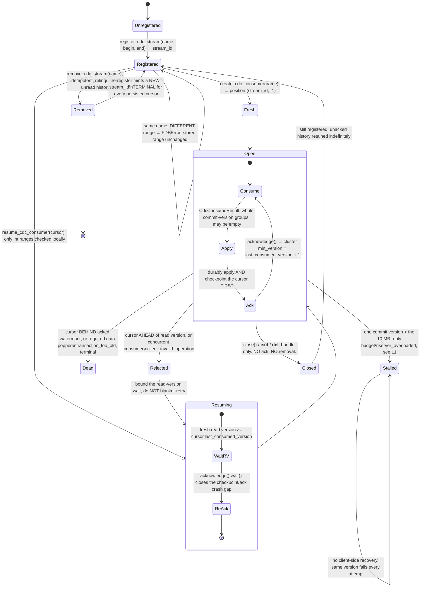

# FoundationDB native CDC, deep dive

Trello: [Research FoundationDB CDC Architecture & API](https://trello.com/c/DLfs4a8S)
(`DLfs4a8S`).

Source-read only, 2026-09-09. No cluster contacted, no binding imported, no probe run. Nothing here
carries ⚑LIVE. Revised 2026-09-11 for review on PR #3: baseline snapshot (§1.6), threading (§2.7),
retention monitoring (§3, *Retention*), Kafka key and partitioning (§5.1).

## TL;DR

| # | Deliverable | The answer | |
|---|---|---|---|
| 1 | Stream lifecycle | `register_cdc_stream` → `create_cdc_consumer` (or `resume_cdc_consumer` from a persisted cursor) → `consume` → durably apply **and checkpoint** → `acknowledge` → `close`. `close()` neither acks nor removes. Removal is terminal. Re-registering the name mints a new `stream_id`, killing every persisted cursor that names the old one. | [§1](#1-cdc-stream-lifecycle-deliverable-1) |
| 2 | Python API | Five future-returning `Database` methods (`register_cdc_stream`, `remove_cdc_stream`, `list_cdc_streams`, `create_cdc_consumer`, `resume_cdc_consumer`), plus a `CdcConsumer` handle with `consume` / `acknowledge` (futures) and `get_position` / `close` (synchronous). Five value types, one non-exhaustive enum. `consume()` and `acknowledge()` take no arguments. No `asyncio`; `wait()` parks only its caller (§2.7). All of it prospective on unmerged PR #13925. | [§2](#2-python-api-deliverable-2) |
| 3 | Limitations | At-least-once only. One oversized commit version stalls a stream permanently (`server_overloaded`, and no way to skip the version). No error mapping shipped, and the standard retry predicate is wrong about two of the three CDC error codes. Unacked streams retain TLog history with no age bound, and a TLog disk at 5 % free stops commits cluster-wide. **P1: #13925 and #13971 redefine the same symbols at the same API version, undetectable at load.** | [§3](#3-known-limitations-and-gaps-deliverable-3) |
| 4 | API version | API 800, hard-gated, raising synchronously below it. Selecting 800 also removes tenants and metaclusters, blob granules, ChangeFeed, storage cache servers, the configuration database and dynamic knobs, and encryption at rest. No released FDB has CDC. 7.4.7 has zero CDC symbols, and 8.0.0 is unreleased with no date. | [§4](#4-api-version-requirements-deliverable-4) |
| 5 | Directory Layer | CDC registers **byte ranges**, not paths. Child **directories** get independent prefixes and will not appear on a parent stream. Nested **subspaces** share the prefix and will. Register `[rawPrefix, strinc(rawPrefix))`, never `dir.range()`. | [§2.5](#25-registering-a-directorys-range-) |
| 6 | Kafka proposal mapping | CDC identity is `(version, array index)`. `sequence_no` and `VersionEnd` are bridge inventions. Empty `consume()` that still advances the cursor is the native idle watermark. The Kafka key picks a partition, not the partition count, and no key gives atomicity. Default: one partition per stream, FDB key as record key, `VersionEnd` per group; Kafka transactions next. | [§5](#5-mapping-onto-the-kafka-proposal), [§5.1](#51-kafka-record-key-partitioning-and-atomicity-) |
| 7 | Baseline snapshot | CDC starts at the registration commit version and never returns state. Register **first**, then range-read the directory in chunks, one transaction and one read version `R_i` each (5 s MVCC limit), then replay CDC dropping every mutation piece at `v ≤ R_i` in its chunk. Exact for every mutation type. Snapshot-then-register silently loses `(R, C)`. | [§1.6](#16-baseline-snapshot-and-handoff-) |

## How to read this

Ninety seconds: the table above, the state diagram in [§1.1](#11-the-state-machine-), the reference
table in [§2.1](#21-reference-table-), and the ranked limitations table in
[§3](#3-known-limitations-and-gaps-deliverable-3). Baseline snapshot is
[§1.6](#16-baseline-snapshot-and-handoff-). Directory Layer is
[§2.5.1](#251-directory-layer-why-the-connector-keys-off-directories-). Replay is
[under §3](#replay-under-at-least-once-). Proposal mapping is
[§5](#5-mapping-onto-the-kafka-proposal). That is the whole ticket.

Headings are marked ▲ must-read (you will get this wrong if you skip it) or ▽ skim (reference). Each
section opens with a one-line takeaway. The takeaways alone give the claims without the evidence.
Appendices hold derivations only.

## 0. Read this first ▲

### Pins

| Ref | SHA | Meaning |
|---|---|---|
| Pin | [`c50931feb`](https://github.com/apple/foundationdb/commit/c50931feb) | 8.0.0, API 800 (`CMakeLists.txt:27`, `flow/ApiVersions.cmake:2`) |
| `upstream/main` | [`b870261ee`](https://github.com/apple/foundationdb/commit/b870261ee) | upstream head when read |
| [PR #13925](https://github.com/apple/foundationdb/pull/13925) | [`ee1fa01e6`](https://github.com/apple/foundationdb/commit/ee1fa01e6) | Python CDC bindings. Open, `mergeable_state: dirty` |
| [PR #13971](https://github.com/apple/foundationdb/pull/13971) | [`c7fb905dc`](https://github.com/apple/foundationdb/commit/c7fb905dc) | multi-range CDC streams. Open, `mergeable_state: dirty` |

### Verified vs prospective

The C API, server implementation, API-version constant and `ENABLE_NATIVE_CDC` knob all come from the
pin. Two things sit outside it, marked as such wherever they appear.

- **PR #13925** covers all of §2 and most of §1. Prospective on it landing as written. Build against
  it anyway, since the CDC feature author wrote it and CI is green, but it is not a released contract,
  and the P1 ABI conflict (L2 in §3) puts its shape at risk.
- **`release-notes-800.rst`** is the source for §4.2's removal table. Added by `a7887284c` after the
  pin, on `upstream/main` only, and titled a draft.

---

## 1. CDC stream lifecycle (deliverable 1)

> In one line: register, consume, checkpoint, acknowledge, close. The ack order is not negotiable and
> removal is terminal.

Server behaviour is cited to the pin, Python names to #13925 @ `ee1fa01e6`.

### 1.1 The state machine ▲



> **Signature risk.** The first edge is the least stable thing here. PR #13971 (`c7fb905dc`, open)
> replaces the C signature with `(name, name_length, ranges, range_count)` under the *same* symbol at
> the *same* API version, no `_v2`. See L2 in §3.

### 1.2 Who holds what state ▽

| Lives where | What | Source |
|---|---|---|
| Cluster (transaction state) | `\xff/cdc/name/<name>` → `CDCStreamId`; `\xff/cdc/maxStreamId` (monotonic allocation); `\xff/cdc/keys/<streamId>` → the **immutable** `KeyRange`; `\xff/cdc/tagHistory/<streamId>/<version>/<tag>` | `design/cdc.md:335-343` |
| Cluster (storage-backed) | `\xff\x02/cdc/minVersion/<streamId>` → `Version`, the retention watermark. Versionstamped at registration, advances to `V+1` on ack. `<streamId>` is an 8-byte little-endian `uint64`, not decimal text. The value is a 10-byte versionstamp until the first ack, then a protocol-versioned `int64`. Read it through `list_cdc_streams()`, not raw | `design/cdc.md:356-371`; `SystemData.cpp:791, 910-950` |
| Client handle (in memory) | `CdcConsumer`, an owned native handle, not a `Future`. Its only client-visible state is the delivered position, via `get_position()` | `impl.py:1547-1615` |
| **Your application (durable)** | `CdcCursor(stream_id, last_consumed_version)`, which "contains no process-local state". `resume_cdc_consumer` never reads the acked position back from the cluster; it rebuilds the handle from those two ints | `impl.py:1465-1480` |

`min_version` reaches the client only via `list_cdc_streams()`, and it is "a retention frontier, not a
snapshot version for the registered key range" (#13925). Never a read version.
Retention releases per CDC *tag*, at `safePop(T) = min(minVersion(S))` over every live stream sharing
the tag, so a slow sibling stream pins your history too (`design/cdc.md:591-594`).

### 1.3 Acknowledgement semantics ▲

> In one line: `acknowledge()` is a cumulative durable watermark, takes no argument, and is atomic
> with nothing.

`acknowledge()` returns `FutureVoid` and acks whatever `get_position()` would return, the
`last_consumed_version` of the last successful `consume()`. No per-record ack, no ack-by-version
(`impl.py:1598-1605`). It advances cluster `minVersion` to `V + 1` (`design/cdc.md:369-371`;
`native_cdc_tests.py:286-287`), releasing history through it. Re-acking a durable position moves
nothing (`native_cdc_tests.py:281-287`). It is "not atomic with writes to a downstream system or an
application checkpoint" (#13925), and CDC methods are not on `Transaction`, so
`@fdb.transactional` cannot make them so.

**Why the order is not negotiable.** Acking before you have durably applied *and* checkpointed turns
a crash into data loss. The ack releases TLog history through that version and the un-checkpointed
work cannot be replayed. Checkpointing first turns a crash into duplicate delivery instead, which you
must tolerate regardless, since "unacknowledged mutations may be redelivered after CDC proxy
replacement" (#13925).

Never ack a position you have not checkpointed. "Even an empty reply can advance the cursor" (#13925),
so an ack after an empty reply still needs its checkpoint first. Skipping both the checkpoint and the ack
for an empty reply is safe, which is why [§2.7](#27-threads-blocking-and-the-network-thread-) can
coalesce them. Empty replies are the norm.
`consume()` is a long poll. The proxy caps each server-side lease at `CDC_PROXY_CONSUME_POLL_TIMEOUT`
(5.0 s, `fdbserver/core/ServerKnobs.cpp:186`; `CDCProxy.cpp:1544-1552`), but the client renews an
empty, unadvanced lease itself (`NativeCdc.cpp:809-814`), so `wait()` returns only on data, an
advanced watermark, or an error ([§2.7](#27-threads-blocking-and-the-network-thread-)).

`close()` releases the handle and acknowledges nothing. `min_version` is unchanged across a close
(`impl.py:1570-1576`, `native_cdc_tests.py:257-258`).

### 1.4 Resuming after a crash ▲

> In one line: the `Resuming` box is mandatory, not defensive. `resume_cdc_consumer` validates almost
> nothing and a resumed handle carries no delivery proof.

`resume_cdc_consumer(cursor)` checks only that `stream_id` is in `[0, 2**64)` and
`last_consumed_version` in `[-2**63, 2**63)`, raising `ValueError` otherwise and `TypeError` for
non-ints (`impl.py:1465-1480`). "Stream existence and cursor validity are checked when consuming or
acknowledging, not by this method" (#13925). `get_position()` echoes the cursor until
the first consume (`native_cdc_tests.py:267`).

So resume only from a durably processed checkpoint, wait for a fresh read version to reach
`cursor.last_consumed_version`, then reissue `acknowledge()` and wait on it. That closes the crash
window between persisting the checkpoint and completing its acknowledgement (#13925).
A resumed handle "lacks the original handle's delivery proof", so a cursor ahead of that read version
draws `client_invalid_operation` even if the data was previously delivered. Upstream is explicit:
"bound the read-version wait rather than retrying all invalid-operation errors"
(#13925; proxy check at `fdbserver/cdcproxy/CDCProxy.cpp:1527-1535`).

The other direction is `transaction_too_old`. Either the cursor is behind the already-acked
watermark, or the required tagged data was popped, and the latter "indicat[es] a retention invariant
violation rather than a supported expiration policy" (`design/cdc.md:282-286`;
`CDCProxy.cpp:1504-1506`). Both are terminal, and the native client does not retry them
(`design/cdc.md:288-291`).

### 1.5 Removal, retention, and admission ▽

- **Removal is terminal.** Re-registering the name "does not redirect their cursors to the new
  stream" (#13925). It allocates a fresh id from `\xff/cdc/maxStreamId`, so every
  persisted `CdcCursor` naming the old id is dead. `remove_cdc_stream` is idempotent
  (`native_cdc_tests.py:311-312`).
- **The range is immutable for the life of a `stream_id`.** Changing one means remove plus
  re-register (`native_cdc_tests.py:317-323`; non-goal at `design/cdc.md:84-85`).
- **An abandoned stream costs disk forever.** L3 in §3. A cluster-level hazard, not a consumer-local
  one.
- **Admission.** Registering a *new* stream requires `ENABLE_NATIVE_CDC` on the server processes
  (§4.3). With it disabled, listing, removal, consumer creation, resume, consumption and
  acknowledgement keep working (`design/cdc.md:709-713`). Upstream advises "Register long-lived
  streams rather than a stream per request" (#13925).

### 1.6 Baseline snapshot and handoff ▲

> In one line: register first, snapshot in chunks each stamped with its own read version, then replay
> CDC dropping every mutation at or below its chunk's version. Snapshot first and you lose data.

**What a fresh consumer sees.** Registration versionstamps `minVersion` with its own commit version
`C` (`NativeCdc.cpp:442-443`; `design/cdc.md:228-231`). The proxy sets
`bufferedThrough = minVersion - 1` (`CDCProxy.cpp:1183-1186`), and a `-1` cursor begins at the
stream's *current* `minVersion` (`:1538`). A fresh consumer on a never-acked stream therefore gets
every covered mutation at versions `≥ C` and no state. On an already-acked stream it starts at
`last ack + 1`. Registration returns only the id (`CDCProxyInterface.h:59-61`). `min_version` equals
`C` only until the first ack, and is "a retention frontier, not a snapshot version"
(#13925). The protocol below never needs `C`.

**No single-transaction snapshot.** Reads fail with `transaction_too_old` about 5 s after the read
version (`MAX_READ_TRANSACTION_LIFE_VERSIONS`, `fdbserver/core/ServerKnobs.cpp:152`;
`known-limitations.rst:86-89`). A directory is read across many transactions at many versions, the
same inconsistent-copy-plus-log shape as FDB backup (`backups.rst:18`), with CDC as the log. Blob
granules and ChangeFeed are deleted from the 8.0 binary (#12435, #12470, both in the pin). BulkDump
writes one version per subrange (`bulkdump.rst:15` @ `upstream/main`), the same shape, and probably
the same rule (UNVERIFIED: whether the manifest version is a read version). Upstream describes one
consistent snapshot version `V` and warns that "a scan across unrelated read versions followed by
registration can miss concurrent writes" (main `design/cdc.md:950-957`). The per-chunk filter below
is our derivation from the same contract.

**Protocol.**

1. `register_cdc_stream(...).wait()`. Every later read version is `≥ C` (`api-c.rst:728`).
2. Tile `[rawPrefix, strinc(rawPrefix))` (§2.5) into chunks, one transaction each. Take `R_i`, read
   from `b_i` within a time or row budget well under 5 s, and end at `e_i = last_key + b"\x00"` (or
   the range end). Record `(b_i, e_i, R_i)`. No gaps. On `transaction_too_old`, redo the chunk from
   `b_i` rather than stitching two versions into one chunk. Split points:
   `Transaction.get_range_split_points` (**pin** `impl.py:545`).
3. Publish each chunk's rows plus a chunk marker (§5). Checkpoint the chunk map durably with the cursor.
4. Consume. Forward a mutation piece in chunk `i` **iff** chunk `i` is snapshotted **and** `v > R_i`.
   Split `CLEAR_RANGE` at chunk boundaries first. Once `v > max R_i`, the filter is a no-op: steady
   state.

**Interleaved variant (bounded retention).** Step 4 can run *during* step 2. Drop pieces in chunks not
yet snapshotted, and before reading each chunk wait for a read version `≥ last_consumed_version`,
bounded as in §1.4, since that frontier may briefly lead the read version (`design/cdc.md:565-566`).
Take `R_j`, read chunk *j* and mark it snapshotted on the consume thread between replies; never process
a reply while a chunk read is in flight, or its `v > R_j` pieces for chunk *j* are silently dropped.
Acks then proceed normally. The sequential form holds all covered CDC on TLogs for the snapshot's
whole duration (L3), and a recovery in that window keeps the cluster below `FULLY_RECOVERED`
(`design/cdc.md:682-690`).

**Why it converges.** Chunk `i` is exactly its keys' state at `R_i`, and CDC holds every version
`≥ C`, where `C ≤ R_i`. Applying `v > R_i` in version order reproduces every later state, atomics
included. The boundary is `≤ R_i` dropped, because a read at `R_i` already contains version `R_i`.

| Op class | Replay all of `≥ C` over the snapshot (no filter) | With the `v ≤ R_i` filter |
|---|---|---|
| `SET_VALUE`, `CLEAR_RANGE`, `MAX`/`MIN_V2`, `AND_V2`/`OR`, `BYTE_MIN`/`BYTE_MAX` | Converges if each key sees one op family (SET/CLEAR, numeric `MAX`/`MIN_V2`, bitwise `AND_V2`/`OR`, lexicographic `BYTE_*`). Mixed families on one key can diverge. Downstream briefly sees pre-snapshot values | Exact |
| `ADD`, `XOR`, `APPEND_IF_FITS` | **Wrong.** `(C, R_i]` applied twice ([replay table](#replay-under-at-least-once-)) | Exact |
| `COMPARE_AND_CLEAR` | Depends on the current value | Exact |

**What breaks it.**

| Mistake | Effect | Guard |
|---|---|---|
| Snapshot before registration | `(R, C)` in neither source, silently | Register first |
| Any ack between registration and the first consume | The fresh cursor starts past `min R_i + 1` (`CDCProxy.cpp:1538`), losing the gap | Sequential form only. Single writer (L4) is the real guard; asserting `min_version ≤ min R_i + 1` before the first consume catches a violation but cannot prevent one |
| Chunk stitched across a retry | One `R_i` no longer describes the chunk | Redo the chunk |
| Gaps, or `dir.range()` instead of the raw range | Keys with no `R_i`, missing from the snapshot | Tile the §2.5 range exactly |
| `CLEAR_RANGE` forwarded whole | Deletes keys a later chunk shows re-set | Split at chunk bounds |
| `<` instead of `≤` | Atomics at `v = R_i` double-apply | `≤` |

---
## 2. Python API (deliverable 2)

> In one line: five `Database` methods, one consumer handle, five value types and one non-exhaustive
> enum, all prospective on #13925.

Prospective, source-read, not observed: apple/foundationdb PR #13925 (head `ee1fa01e6`), open and
unmerged. #13971 breaks two signatures ([§2.6](#26-below-the-api-and-the-13971-break-)).

### 2.1 Reference table ▲

Five methods on `Database`, five on `CdcConsumer`, none
on `Transaction` or `Tenant`, which "cannot be made atomic with application writes by using
`transactional`". No defaults, type annotations, options, limits or timeouts.

| Call | Parameters | Returns | Resolved value | Sync? |
|---|---|---|---|---|
| `Database.register_cdc_stream` | `name, begin_key, end_key`, all `bytes` | `FutureUInt64` | `int` stream id (unsigned 64-bit) | future |
| `Database.remove_cdc_stream` | `name: bytes` | `FutureVoid` | `None`, idempotent (`native_cdc_tests.py:311-312`) | future |
| `Database.list_cdc_streams` | none | `FutureCdcStreamInfoArray` | `list[CdcStreamInfo]` | future |
| `Database.create_cdc_consumer` | `name: bytes` | `FutureCdcConsumer` | `CdcConsumer` | future |
| `Database.resume_cdc_consumer` | `cursor: CdcCursor` | `FutureCdcConsumer` | `CdcConsumer` | future |
| `CdcConsumer.consume` | none | `FutureCdcConsumeResult` | `CdcConsumeResult` | future (long poll) |
| `CdcConsumer.acknowledge` | none, no token, no version | `FutureVoid` | `None` | future |
| `CdcConsumer.get_position` | none | | `CdcCursor` | synchronous |
| `CdcConsumer.close` | none | | `None`, idempotent | synchronous |
| `CdcConsumer.__enter__` / `__exit__` | context manager | | `self` / `None` | synchronous |

Errors:

| Raised | When |
|---|---|
| `RuntimeError("Native CDC requires API version 800 or later")`, or, at API 800 with a `libfdb_c` lacking the experimental symbols, `RuntimeError("The loaded FoundationDB C library does not support native CDC")` `from AttributeError` | first statement of all five `Database` methods, before coercion and before any future exists (`impl.py:1426, 1444, 1452, 1459, 1471`) |
| `TypeError("Key must be of type bytes")` | key args via `keyToBytes()`, so `str` or anything without `as_foundationdb_key()` (**pin** `impl.py:1525-1530`) |
| `ValueError` | `resume_cdc_consumer` range-checks both cursor fields via `operator.index()` (`native_cdc_tests.py:347-368`) |
| `ValueError("CDC consumer is closed")` | `consume`/`acknowledge`/`get_position` after `close()` |
| `fdb.FDBError` **from the future, not the call** | all native errors: bad name, range conflict, missing stream (`native_cdc_tests.py:317-323`) |

- One `consume` or `acknowledge` outstanding per handle. Acks affect the whole stream, and `close()`
  neither acks nor removes it. Enforced in C, where the second future fails
  `client_invalid_operation` (`NativeCdc.cpp:833-839`). §2.7.
- `FutureCdcConsumer.wait()` memoizes its `CdcConsumer` under a lock. Each C getter transfers a
  reference, so repeated `wait()`/`result()` return one identical object (`native_cdc_tests.py:221-223`).
- Only the `Database` methods are gated. The seven `Cdc*` names export at any API version, covered by
  a CI job at `--api-version 740`.

### 2.2 Value types ▽

Immutable `NamedTuple`s plus one `IntEnum`.

| Type | Fields |
|---|---|
| `CdcCursor` | `stream_id: int`, `last_consumed_version: int` |
| `CdcStreamInfo` | `name: bytes`, `stream_id: int`, `begin_key: bytes`, `end_key: bytes`, `min_version: int` |
| `CdcMutation` | `type: int`, `param1: bytes`, `param2: bytes` |
| `CdcVersionedMutations` | `version: int` (commit version, C `int64_t`), `mutations: Tuple[CdcMutation, ...]`, may be empty |
| `CdcConsumeResult` | `mutations: Tuple[CdcVersionedMutations, ...]`, one entry per commit version; `last_consumed_version: int`, the watermark *after* this reply |

`CdcMutationType(enum.IntEnum)` has sixteen values, mirroring `MutationRef::Type`:

```
SET_VALUE=0 CLEAR_RANGE=1 ADD=2 AND=6 OR=7 XOR=8 APPEND_IF_FITS=9 MAX=12 MIN=13
SET_VERSIONSTAMPED_KEY=14 SET_VERSIONSTAMPED_VALUE=15 BYTE_MIN=16 BYTE_MAX=17
MIN_V2=18 AND_V2=19 COMPARE_AND_CLEAR=20
```

**Never call `CdcMutationType(code)` unguarded.** `CdcMutation.type` is a plain `int` (`native_cdc_tests.py:117`),
code `255` round-trips (`native_cdc_tests.py:68, 108`), and callers must "handle an unrecognized raw `uint8_t`
value" (`api-c.rst:583-584`).

### 2.3 What a mutation record is ▲

Nesting is `CdcConsumeResult` → `CdcVersionedMutations` → `CdcMutation` (§2.2). `param1`/`param2` are Python-owned `bytes` copied with `ctypes.string_at`,
independent of the native arena (`native_cdc_tests.py:96-117`), and a null pointer of length 0 decodes to `b""`
(`native_cdc_tests.py:74`). Per type: `SET_VALUE` gives key and value, `CLEAR_RANGE` gives
begin and end clipped to the registered range, atomic ops give key and operand. Raw operations, never
a materialized post-mutation value.

**A record's identity is `(version, array index)` and nothing else.** No timestamp, transaction id or
boundary, sequence number or proxy id appears in any of the twelve CDC declarations at
`fdb_c.h:400-467`. One commit version covers a whole commit batch, so several transactions' mutations
share a version, inseparably. Intra-version order is tuple order, but upstream asserts it only
order-insensitively (`assertCountEqual`, `native_cdc_tests.py:243, 299`).

**Which types can appear.** CDC delivers committed effects, so three groups never reach a consumer:

- **3-5, 10, 11, 21-23** (`Debug*`, `NoOp`, `AvailableForReuse`, `Reserved_For_*Message`) are
  server-internal or reserved, and the C enum omits them (`CommitTransaction.h:70-96`,
  `fdb_c.h:194-212`).
- **14/15 `SET_VERSIONSTAMPED_*`** are declared but dead on the wire, rewritten to `SetValue` before
  CDC tagging (§3, *Mutation fidelity*).
- **6 `AND`, 13 `MIN`** are rewritten client-side to `AND_V2`/`MIN_V2` above API 510, so only a
  separate legacy client at API < 510 could emit them.

Replies carry complete commit-version groups only, which callers must "preserve".
`consume()` takes no arguments, so there is no row or byte limit, no
caller-settable timeout, and no streaming mode. An empty reply is legal and still advances the cursor
(`native_cdc_tests.py:121-131`). There is no end-of-stream marker.

### 2.4 Usage, illustrative and untested ▲

From the #13925 doc example, exercised by `native_cdc_tests.py:202-315`.

```python
fdb.api_version(800)
db = fdb.open()

stream_id = db.register_cdc_stream(b"orders", b"/orders/", b"/orders0").wait()

with db.create_cdc_consumer(b"orders").wait() as consumer:
    while True:
        reply = consumer.consume().wait()     # whole version groups; may be empty
        for group in reply.mutations:
            for m in group.mutations:
                # m.type is a plain int; the enum is non-exhaustive
                apply_downstream(group.version, m.type, m.param1, m.param2)

        checkpoint(consumer.get_position())   # 1. effects + cursor durable together
        consumer.acknowledge().wait()         # 2. only then release retention
```

That ordering is the point. §1.3 carries the argument.

### 2.5 Registering a directory's range ▲

**Register `[rawPrefix, strinc(rawPrefix))`, never `dir.range()`.** `register_cdc_stream` takes raw
begin/end bytes, but `Subspace.range()` is `[rawPrefix + b"\x00", rawPrefix + b"\xff")`
(`subspace_impl.py:51-53` over `tuple.py:536-537`), which drops the bare prefix key and any
`rawPrefix + b"\xff"…` key. Every tuple-packed key falls inside `dir.range()`, so the two look
equivalent until someone writes a raw-suffix or empty-tuple key. By then the registration is durable
and immutable, and that mutation is silently invisible. `validateNativeCdcStream`
(`fdbclient/NativeCdc.cpp:98-102`) rejects only an empty name, an empty range, or a range outside
`normalKeys`, not prefix alignment.

`strinc` is not exported from `fdb`; it is `fdb.impl.strinc` (**pin** `impl.py:2162-2166`). Nor is a
directory's prefix contractually stable. A `move` changes nothing about an already-registered range,
and `developer-guide.rst:141-216` promises nothing either way.

### 2.5.1 Directory Layer: why the connector keys off directories ▲

> In one line: a directory is a contiguous exclusive key range. CDC tracks key ranges, not paths.
> Child directories are not in that range.

From the [Developer Guide — Directories](https://apple.github.io/foundationdb/developer-guide.html#directories)
(`developer-guide.rst` directories section, **pin**):

- A directory is a hierarchical path (tuple of strings) mapped by a high-contention allocator onto a
  **short independent prefix**.
- `create` / `open` / `create_or_open` return a `DirectorySubspace` that is both a directory and a
  subspace.
- **Subdirectories do not nest under the parent prefix.** `('alpha',)` and `('alpha','bravo')` get
  unrelated prefixes. You cannot range-read a directory and its descendants together, and a CDC
  stream on the parent **will not** see writes into the child directory.
- **Directory partitions** (`layer=b'partition'`) *do* prepend the parent prefix to descendants, at
  the cost of longer keys and no cross-partition moves.
- Nested **subspaces** (`users['profile']`) *do* share the directory prefix; they are keys under the
  subspace, not separate directories. Writes there **will** appear on a stream registered for that
  directory's prefix range ([§2.5](#25-registering-a-directorys-range-)).

CDC has no directory object. It only accepts `[begin, end)` in normal user key space. For this
project that means:

1. `dir = fdb.directory.create_or_open(db, ('my_data',))`, then register
   `[rawPrefix, strinc(rawPrefix))` as in §2.5. That captures **this directory's content keys only**.
2. Writes into child **directories** do not appear on that stream.
3. Writes into nested **subspaces** of the same directory do.
4. After #13971, one stream can union several directory prefixes (parent + selected children) under
   one cursor and one ack. Independent per-directory progress still needs **separate streams**.

That is the entire reason the connector proposal keys off directories.

### 2.6 Below the API, and the #13971 break ▽

#13925 adds no C code. It prototypes twelve existing `fdb_c.h` symbols lazily on first CDC use, so a
`libfdb_c` at API 800 without them still serves non-CDC callers (`native_cdc_tests.py:325-345`). Struct layout: [Appendix A](#appendix-a-abi-layout-receipt-).

**The signatures in §2.1 will not survive #13971 unchanged.** It replaces
`fdb_database_register_cdc_stream`'s four trailing key parameters with
`(FDBKeyRange const* ranges, int range_count)` and swaps `FDBCdcStreamInfo`'s `key_range` for `ranges`
plus `range_count` (52 bytes down to 40), under the same symbol names at the same API 800
(#13971), while touching zero files under `bindings/python`. Landed as written, `register_cdc_stream` would pass seven
C arguments to a five-argument function and `CdcStreamInfo.begin_key`/`.end_key` would read a layout
that no longer exists. Expect `register_cdc_stream(name, ranges)` and `CdcStreamInfo.ranges`
post-merge. Until then §2.1 is the #13925-only contract. Full analysis: L2 in §3.

### 2.7 Threads, blocking and the network thread ▲

> In one line: `wait()` parks only its own thread, and the network thread is shared but never blocked
> by it. The hazards are per handle, not per `Future`: one op outstanding, no consume before the
> previous batch is acked, never block in a callback.

Python behaviour is **prospective** on #13925 @ `ee1fa01e6`; client and server mechanics are the pin.

**One network thread per process.** `fdb_setup_network()` "can only be called once" and "it is not
possible to run more than one network thread" (`api-c.rst:188, :198`). The binding runs it as daemon
`fdb-network-thread` (`impl.py:2349-2360, :2510-2516`), and `fdb.open()` caches one `Database` per
cluster file (`impl.py:2530-2547`). Every CDC and KV call from every thread is marshalled onto it. The
consumer is "confined to the network thread" (`ThreadSafeTransaction.cpp:109-135`). The option
`client_threads_per_version` "implies disable_local_client", so it needs external client libraries
(`fdb.options:121-123`). Unevaluated.

| Operation | Blocks | Mechanism |
|---|---|---|
| `Future.wait()` | The calling thread only, with the GIL released | Not `fdb_future_block_until_ready`. It registers `on_ready` and parks on a per-thread `multiprocessing.Semaphore` (`impl.py:733-756`). The library is loaded as `ctypes.CDLL` (`impl.py:1819-1830`). |
| Outstanding `consume()` | Nothing client-side | The proxy holds the request until the stream's buffered frontier passes the cursor, which tag peeks advance even with no mutations, or for up to `CDC_PROXY_CONSUME_POLL_TIMEOUT` (5.0 s, server knob), then replies empty at the old cursor (`CDCProxy.cpp:771-791, 1468-1482, 1544-1552`). The client re-polls on an empty, unadvanced reply (`NativeCdc.cpp:809-814`), so **`wait()` does not return at lease expiry**. It returns on mutations, an advanced watermark, or an error, so an idle stream probably returns empty-but-advanced replies at peek cadence (UNVERIFIED). No timeout parameter. |
| `on_ready` callback | The network thread, so every FDB op in the process | Runs there, or immediately on the caller if the future is ready (`api-python.rst:1194`), after taking the GIL. "…performing CPU intensive tasks will block the FoundationDB client thread and therefore all database access from that client" (`developer-guide.rst:430`). |
| `wait()` inside a callback on an unready future | **Silent** deadlock | Documented: "Blocking in a callback on a non-ready future will cause a deadlock" (`developer-guide.rst:430`). C raises `blocked_from_network_thread` only on its own block path (`ThreadHelper.h:313-317`). Python's semaphore path skips that check. |
| Reply decode | The network thread, then the caller | C++ deep-copies each reply on the network thread (`ThreadSafeTransaction.cpp:67-90`). Python copies again on the waiting thread (`impl.py:942-970`). Up to 10 MB per reply (L1). |

| Hazard | Real? | Evidence |
|---|---|---|
| Two threads `wait()` on one `Future` | No. Callbacks chain, and each waiter has its own semaphore. | `ThreadHelper.h:399-402`; `impl.py:740-746` |
| Two Python owners of one native consumer | Handled. Memoized under a lock, since each C getter transfers a reference. | `impl.py:922-939`; `fdb_c.cpp:436-439` |
| `close()` racing `consume()` on the C pointer | Handled. Both take `CdcConsumer._lock`. | `impl.py:1559, 1570-1605` |
| A second `consume`/`acknowledge` while one is outstanding | **Real.** The second future fails with `client_invalid_operation`. The Python lock guards only issuing the call. | `NativeCdc.cpp:833-839, :880-886` |
| `consume()` N+1 before `acknowledge()` of N | **Real, data loss.** The ack covers the latest delivered position, including the unproduced batch. | `NativeCdc.cpp:848` |
| `close()` with a consume in flight | Does not cancel it. The reply is still valid, but the handle can no longer ack. | `ThreadSafeTransaction.cpp:118-127` |
| `cancel()` (or dropping an unready future), then consume again | **Real, up to 5 s.** The handle frees at once, but the proxy holds `activeConsumes` until data arrives or the lease expires, so the next consume from any handle can draw `client_invalid_operation`. Inferred, not observed. | `fdb_c.cpp:270-280`; `NativeCdc.cpp:810-811, :827-829`; `CDCProxy.cpp:1511-1520` |
| `get_position()` from another thread | Safe. It reads a spinlocked copy that lags an outstanding consume. | `ThreadSafeTransaction.cpp:62-65, :84-96, :137` |

**Kafka.** confluent-kafka `produce()` only enqueues and raises `BufferError` when the queue is full.
Delivery callbacks fire only inside `poll()`/`flush()` on the calling thread, and librdkafka's
threads send regardless
([Producer.c](https://github.com/confluentinc/confluent-kafka-python/blob/master/src/confluent_kafka/src/Producer.c),
[librdkafka INTRODUCTION.md](https://github.com/confluentinc/librdkafka/blob/master/INTRODUCTION.md)).
`poll` and `flush` release the GIL (`CallState_begin`,
[confluent_kafka.h](https://github.com/confluentinc/confluent-kafka-python/blob/master/src/confluent_kafka/src/confluent_kafka.h)).
A shared `Producer` is thread-safe, but `flush()` waits on every thread's messages and callbacks fire
on whichever thread polls.

**asyncio.** Unsupported. `api-python.rst:1293-1308` documents only `None`, `gevent` and `debug`.
`impl.py:2448-2467` keeps an undocumented `event_model="asyncio"` that mutates
`asyncio.futures._FUTURE_CLASSES`. That name is absent from the CPython 3.14.5 stdlib, so treat the
model as dead. To bridge, use `await loop.run_in_executor(pool, fut.wait)`, or
`fut.on_ready(lambda _: loop.call_soon_threadsafe(settle))` with `settle` calling `fut.wait()` on the
loop thread. Never decode on the network thread.

**Recommended bridge model.**

1. One `Database` per process. One thread per stream owns that stream's `CdcConsumer` and its own
   `Producer`. No handle crosses threads except the supervisor's `cancel()` at shutdown, followed by
   `close()`, never an ack.
2. Strictly serial per stream: `consume().wait()` → produce → `flush()` with no delivery error →
   checkpoint → `acknowledge().wait()` → consume (§1.3). Any delivery failure means no ack.
3. Empty replies may be coalesced: consume again without acking, then checkpoint and ack at most every
   few seconds or when a reply carries data. Safe because an empty reply carries nothing to lose.
4. No blocking, decoding or Kafka calls inside `on_ready`.
5. Scale by streams per process, then by processes. One stream cannot be parallelised (L4).

---
## 3. Known limitations and gaps (deliverable 3)

> In one line: one range, one consumer, at-least-once, no error mapping, unbounded retention, plus
> one poison pill and one P1.

Three of these can stop the project: L1, L2, L3. L5 and below are constraints to design around, not
risks to plan against. Rows marked prospective depend on a named open PR and describe no shipped
artifact.

| # | Limitation | Consequence for a Kafka bridge | Status | Evidence |
|---|---|---|---|---|
| **L1** | One commit version whose CDC mutations exceed the consume-reply budget (`CDC_PROXY_CONSUME_REPLY_BYTES`, 10 MB) throws `server_overloaded` (1211) at that version on every attempt. Buffer-limit trips set a per-stream flag initialised `false` and never cleared. | Permanent stall. One fat transaction wedges the stream at a fixed version, with no way to skip the version and no forward progress, and the flag survives until the proxy is replaced or the stream re-initialised. `server_overloaded` is not in the retryable predicate, so it arrives raw and a naive loop spins. | Pin | `CDCProxy.cpp:1583-1590` (`firstVersionTooLarge` → `throw server_overloaded()`); flag `:82`, set `:631`/`:652`/`:964`, read `:740`/`:1480`/`:1556`, never cleared; `fdbserver/core/ServerKnobs.cpp:179` |
| **L2** | #13925 and #13971 redefine the same exported symbols at the same API version, with no `_v2` and no version guard. `fdb_database_register_cdc_stream` goes 7 args to 5. `FDBCdcStreamInfo` goes 52 bytes to 40, so `CdcStreamInfo.begin_key`/`.end_key` (§2.2) cease to exist as fields. The value-type break is as bad as the signature break. | Silent memory corruption, both directions. `dlsym` resolves by name and succeeds, so nothing fails at load. See *ABI risk* below. | **Prospective**, both PRs open | #13971; `impl.py:1424-1440` @ `ee1fa01e6`; [mengxu-oai review](https://github.com/apple/foundationdb/pull/13971#pullrequestreview-5074513231) |
| **L3** | Retention is released only by ack or removal, with no age bound. Upstream deliberately rejected automatic expiry: "automatic expiration is still the wrong default because it silently violates the retention contract." | **A cluster-wide write outage, not a consumer-local problem.** CDC tags spill by reference, so one stalled stream pins its TLogs' whole disk queue from its oldest unacked version, including every tag's bytes, not just its own. At 5 % TLog free space Ratekeeper stops every client's commits. It also holds recovery at `ALL_LOGS_RECRUITED`. The way out is always explicit: repair and ack forward, or remove and rebuild downstream ([§1.6](#16-baseline-snapshot-and-handoff-)). Signals in [*Retention*](#retention-what-to-watch-l3-) below. | Pin | `design/cdc.md:252-269`, `:682-690`, `:893-899`; safe-pop rule `:587-594`; `TLogServer.cpp:809-821, 1030-1072`; `Ratekeeper.cpp:936-1066` |
| **L4** | Two processes cannot share a stream, since the server rejects concurrent consumes. Sequential interleaving is *not* rejected, and both share one durable ack frontier. | Bridge instances need external fencing (a single-writer lease). Without it, a restarted instance racing its predecessor advances the shared watermark and each sees the other's versions as already released. No fan-out, no consumer group, no partitioning. | Pin | `CDCProxy.cpp:1511-1516` (`activeConsumes > 0` → `client_invalid_operation`, comment: "A stream has one durable acknowledgement frontier, so concurrent logical consumers cannot be isolated"); cursor-trust check `:1527-1535`; `design/cdc.md:571` |
| **L5** | At-least-once only. The ack cannot be bundled into a transaction with the sink's state, and `acknowledge()` takes no version argument, so granularity is the delivered batch. | Sink writes must be idempotent under whole-batch replay, and replay is expected after commit-proxy replacement rather than exceptional. Identify records by `(stream_id, version, index)` and upsert. That is a dedup identity, not the Kafka record key (§5.1). | Pin | `design/cdc.md:78-83` (exactly-once and transactional ack both listed non-goals) |
| **L6** | CDC delivers committed effects, not application calls. See *Mutation fidelity* below. | No transaction id, timestamp, or application operation name. Nothing in the wire format supplies them. | Pin | `fdb_c.h:213-232` |
| **L7** | No error mapping in the binding. Every native failure arrives as a raw `fdb.FDBError`. See *Errors we have to map* below. | We write the mapping. Three codes matter, and the standard retry predicate is wrong about two. | **Prospective**, #13925 | `NativeCdc.cpp:242-244`; `fdb_c.cpp:167-184` |
| **L8** | A stream's key range is fixed at registration. Changing it means remove plus re-register, terminal for existing cursors. | A downstream rebuild, not a reconfiguration. #13971 would allow a union of up to 1,024 ranges, still with one cursor and one watermark for all of them. | Pin; union **prospective** (#13971) | `design/cdc.md:84-85`; [mengxu-oai review](https://github.com/apple/foundationdb/pull/13971#pullrequestreview-5074513231) ("does not add independent progress or retention for each range") |

### Mutation fidelity ▽

The client rewrites, coalesces and reorders a transaction's mutations before commit, and CDC taps the
result. Mapping a CDC record back to an application-level call is unsound.

| What the applier sees | Why | Evidence |
|---|---|---|
| **Versionstamped ops never arrive.** Types 14/15 are declared but unreachable from user transactions. | `transformVersionstampMutation` splices the resolved stamp and overwrites `mutation.type = SetValue`, and CDC tagging happens later in the same pass, on the rewritten buffer. | `Atomic.h:303-317` from `CommitProxyServer.cpp:186, :189`; tagging `:1452`, `:1546`; `fdb_c.h:204-205` |
| **`MIN`(13) becomes `MIN_V2`(18), `AND`(6) becomes `AND_V2`(19)** at API ≥ 510. | Rewritten client-side. | `NativeAPI.cpp:4025-4030`, `ReadYourWrites.cpp:2159-2164` |
| **Coalescing erases operations.** `set(k,v)` then `add(k,d)` collapses to one `SET_VALUE` of `doLittleEndianAdd(v,d)`, and the `ADD` is gone. | Read-your-writes write map. `add`+`add` merge when operand sizes match and stack when they do not (`:520-528`). `set` then `compare_and_clear` can emit a clear. | `WriteMap.cpp:402-409`, `:413-421`; `ReadYourWrites.cpp:1952-1958` |
| **Order is clears first, then key order**, with adjacent single-key clears merged into one wider `CLEAR_RANGE`. | "Clear ranges must be done first because of keys that are both cleared and set to a new value." `clear(k)` always surfaces as `CLEAR_RANGE(k, k‖\x00)`, since there is no single-key clear type, and `clear_range` is clipped to the registered range, so a replayed clear is uninterpretable without that range. | `ReadYourWrites.cpp:1918`, `:1919-1932`, from `:1386`; `NativeAPI.cpp:4081-4100` |
| **No timestamp, no txn id, no txn boundary.** Only `(version, array index)`. | Several transactions share one commit version with nothing separating them, so the version group is the only atomicity unit. Preserve it. FDB versions are not wall-clock, so synthesise any timestamp at ingest and label it as synthetic. | `api-c.rst:594-598` |

### Replay under at-least-once ▲

> In one line: SET and CLEAR replay harmlessly. ADD, XOR, and APPEND_IF_FITS do not. Exactly-once
> difficulty for the connector is determined by whether the source directory uses those ops.

CDC returns **raw operations**, not post-images (`fdb_c.h` `FDBMutationType` / `FDBCdcMutationType`,
**pin** `:194-232`). Atomic ops are applied at the storage server without reading the old value, so
the bridge cannot flatten them into SET. L5 already requires the sink to tolerate whole-batch
replay. Whether that replay is *safe* depends on `CdcMutation.type`:

| Code | Type | Idempotent under replay? | Notes |
|---|---|---|---|
| 0 | `SET_VALUE` | Yes | `param1=key`, `param2=value` |
| 1 | `CLEAR_RANGE` | Yes as a range op; awkward as a Kafka tombstone | Clipped to the stream range; split at gaps after #13971. No single-key clear type. |
| 2 | `ADD` | **No** — replay double-counts | Little-endian integer add; overflow truncates to operand width |
| 6 | `AND` | Bitwise: usually stable once applied | Deprecated name; missing value stores `param`. At API ≥ 510 rewritten to `AND_V2` (19) before CDC sees it |
| 7 | `OR` | Same | |
| 8 | `XOR` | **No** — replay toggles again | |
| 9 | `APPEND_IF_FITS` | **No** | Appends `param`; silent no-op if the result would exceed max value size |
| 12 | `MAX` | Yes (unsigned int max) | |
| 13 | `MIN` | Yes (unsigned int min) | Missing value stores `param`. At API ≥ 510 rewritten to `MIN_V2` (18) |
| 14 / 15 | `SET_VERSIONSTAMPED_*` | Treat as SET | Declared but **dead on the wire**; rewritten to `SET_VALUE` before CDC tagging (fidelity table above) |
| 16 / 17 | `BYTE_MAX` / `BYTE_MIN` | Yes (lexicographic) | |
| 18 / 19 | `MIN_V2` / `AND_V2` | Yes / bitwise | What `MIN` / `AND` actually arrive as at API 800 |
| 20 | `COMPARE_AND_CLEAR` | Conditional | Clears the key if current value equals operand; replay depends on current value |

CDC does **not** materialize the result of an atomic. A sink that wants a current value must apply
the op itself or take a snapshot. `CLEAR_RANGE` cannot be expressed as one keyed tombstone on a
compacted Kafka topic.

### Errors we have to map ▲

The native client retries exactly four codes: `wrong_shard_server`, `broken_promise`,
`connection_failed`, `request_maybe_delivered` (`NativeCdc.cpp:242-244`). Everything else reaches
Python raw as `fdb.FDBError`. The binding adds only `RuntimeError` (API < 800, missing symbols) and
`ValueError`/`TypeError` (bad cursor, closed consumer). Three codes need our own handling, and the
`is_retryable` column is the part that worries me.

| Code | Meaning on CDC | `is_retryable` | Correct action |
|---|---|---|---|
| `transaction_too_old` (1007) | Requested data already popped, a retention-invariant violation, terminal | **`True`** (`fdb_c.cpp:176`) | Stop. A conventional retry loop spins forever on unrecoverable data loss. Alert, then rebuild. |
| `server_overloaded` (1211) | Reply-budget or buffer-limit trip, including the L1 poison pill | **`False`**, absent from every predicate list (`fdb_c.cpp:167-184`) | Back off and retry with a bound. If it repeats at one version, it is L1: escalate, do not spin. |
| `client_invalid_operation` (2000) | Concurrent consumer, unproven cursor, or a resume that skipped reconcile, or a predecessor's cancelled or abandoned poll still holding the proxy lease (≤ 5 s) | `False` | Terminal for the request. Distinguish fencing loss from cursor-proof failure before retrying. Within 5 s of a cancel or crash, back off past the lease and retry once. |

### Retention: what to watch (L3) ▲

> In one line: watch `read_version − min_version` per stream **and** TLog free disk. Neither is enough
> alone, and `CDCStreamLag` does not exist.

**Mechanism.** An ack commits `minVersion = V+1` (`NativeCdc.cpp:686`). The CDC proxy pops each tag to
`safePop(T)` (`design/cdc.md:587-594`). A TLog truncates its single DiskQueue only up to the minimum
popped location across by-reference tags, and CDC tags (locality `-10`) are by-reference under the
default `log_spill` (`TLogServer.cpp:809-821, 1030-1072`; `FDBTypes.h:68, 1099-1101`). So a stalled
stream pins the whole queue file, and it grows at the TLog's input rate (inferred from
`TLogServer.cpp:1030-1072`, not measured). Memory stays bounded because
spilling keeps it under `TLOG_SPILL_THRESHOLD` (1.5 GB). Disk is what fills. No per-tag quota exists
in `fdbserver/tlog/`.

**When disk fills, the whole cluster stops writing.** `MIN_AVAILABLE_SPACE_RATIO` and
`TLOG_THROTTLE_START_AVAILABLE_SPACE_RATIO` are both 0.05 (`ServerKnobs.cpp:1093, 1103`), so on any
disk over 2 GB the ramp at `Ratekeeper.cpp:941-950` is a step. Below 5 % free the TLog's target and
spring bytes collapse to 1 (`:953-958`), and the MVCC-bandwidth limit computes a rate of zero
(`:1038-1066`): `tpsLimit = 0` at the step itself, reported as `log_server_mvcc_write_bandwidth`. Once
the queue exceeds `free − minFree/2` the reason becomes `log_server_min_free_space` and
`RkTLogMinFreeSpaceZero` fires (`:986-993`). Inferred from source, not observed.

**Reading the watermark.**

- Supported: `CdcStreamInfo.min_version` from `list_cdc_streams()` (**prospective**, #13925). It reads
  the same rows with `READ_SYSTEM_KEYS` in its own transaction (`NativeCdc.cpp:540-581`) and returns
  no read version, so take one separately: `lag = tr.get_read_version().wait() − info.min_version`.
- Raw: `\xff\x02/cdc/minVersion/` followed by the stream id as 8 bytes little-endian. Needs
  `read_system_keys`. It has two value encodings (§1.2). Don't build on it.
- Units: about 1,000,000 versions/s (`VERSIONS_PER_SECOND`, `ServerKnobs.cpp:151`;
  `masterserver.cpp:50-60`), so lag/1e6 ≈ seconds, **in steady state only**. Every recovery jumps
  1e8 versions (`ClusterRecovery.cpp:1387`). Lag is not bytes either: an unacked stream over an idle
  range pins no disk (`TLogServer.cpp:1044`).

**Signals that exist.** None of them reports per-stream TLog bytes. Upstream says that is deliberate
(main `design/cdc.md:904-909`). Status JSON has no CDC section at the pin or on main.

| Signal | Where | Tells you | Ref |
|---|---|---|---|
| `min_version` vs read version | client, `list_cdc_streams()` | per-stream ack lag | #13925, prospective |
| `CDCProxyMetrics` | trace, per CDC proxy, every 5 s | `AcknowledgementLagVersions`, `OldestStreamId` / `OldestRequiredVersion` (the proxy's single worst stream), `SafePopDistanceVersions`, `BufferedBytes` / `ActivePermits` / `BufferLimit` / `BufferWaiters`, `Pop*` counters | `CDCProxy.cpp:1771-1812`; `ServerKnobs.cpp:1297` |
| `CDCProxyConsumeVersionExceedsReplyLimit` (SevWarn) | trace | the L1 poison pill, which leads into L3 | `CDCProxy.cpp:1586` |
| `CDCProxyVersionExceedsBufferLimit`, `CDCProxyRawPeekExceedsBufferLimit` (SevWarn) | trace | proxy budget trips (`server_overloaded`) | `CDCProxy.cpp:958`, `:626` |
| `CDCProxyReRecruitmentFailed` (SevWarnAlways) | trace, cluster controller | streams with no owner | `ClusterController.cpp:718` |
| `TLogMetrics` `MinSysPopTagLocality` / `Id` / `Version` | trace, per TLog | lowest-popped system tag still holding data. Locality `-10` means a CDC tag is holding the TLog | `TLogServer.cpp:747-749, 3686` |
| `queue_disk_available_bytes` / `queue_disk_total_bytes` (log role) | `status json` | TLog disk headroom | `Schemas.cpp:121-124` |
| `qos.performance_limited_by.name` | `status json` | `log_server_mvcc_write_bandwidth` with low TLog free space, or `log_server_min_free_space*`, means TLog disk has already stopped commits. `mvcc_write_bandwidth` alone also fires under ordinary TLog overload | `Schemas.cpp:563-577` |
| `recovery_state.name` | `status json` | stuck at `all_logs_recruited` with live streams means CDC may be holding recovery | `Schemas.cpp:743-764`; `design/cdc.md:682-690` |
| `cdc status [json]` | fdbcli, **post-pin** (main, #13926) | per stream: `min_version`, `acknowledgement_lag_versions`, owner. Per tag: `safe_pop_version`, `blocking_stream_ids`, retired cleanup. Plus proxy samples | main `fdbcli/CdcCommand.cpp:50-148` |

Upstream gives no alert thresholds. It says to derive them "from the deployment's measured write
rate, disk budget, and consumer repair time" (main `design/cdc.md:925-930`). The outage horizon is
`(TLog free − max(100 MB, 5 % of total)) / TLog input bytes per second`. Size TLog disks so that it
exceeds the bridge's worst-case repair time.

### ABI risk (L2, P1, prospective) ▲

#13925 and #13971 cannot both be right at once, and the conflict is silent. Both were open and
unmerged as of 2026-09-09, so this is a risk to our integration plan, not a defect in a shipped
artifact.

- **The offsets** (`_pack_ = 4`, 8-byte pointers). #13925 puts `key_range`@20 and `min_version`@44.
  #13971 puts `ranges`@20, `range_count`@28 and `min_version`@32. Same symbol, same 800 gate, no
  `_v2`.
- **`dlsym` cannot catch it.** The binding is hand-declared ctypes, never compiled against the
  header, and C has no parameter-type mangling. A C caller recompiling fails to build; we do not.
  #13925's lazy resolution removes even the missing-symbol signal.
- **Corruption both ways.** Calling in, the callee reads `begin_key` bytes as `FDBKeyRange*` and
  `len(begin_key)` as an element count. Best case `client_invalid_operation`, worst case a wild
  pointer read. Reading out, offset 20 now holds a pointer and 28 a count, so `string_at` returns
  pointer bytes and the stale 52-byte stride walks the array out of alignment from element 1 on.
  Wrong data, no crash.
- **Unresolved.** The stated migration is a hard break under the unreleased-feature contract: delete
  existing streams, upgrade all CDC clients and servers together, and no cursor bridges it. The
  versioned alternative, keeping the old ABI and adding ranges as a new entry point, is explicitly
  deferred. Reviewer verdict: "Do not treat #13971 plus the current #13925 as an approved combined
  result."

For us that means pinning the `libfdb_c` build and the binding source together, and asserting
`sizeof(FDBCdcStreamInfo)` plus field offsets at load, not via `dlsym`. #13925 ships that assertion
only as a test (`native_cdc_tests.py:46-60`), so a test, not the loader, is the only thing in the
tree that would catch this.

---
## 4. API version requirements (deliverable 4)

> In one line: API 800 or nothing, and 800 costs you tenants, blob granules, ChangeFeed and dynamic
> knobs.

The answer is API version 800, which no released FoundationDB provides.

### 4.1 The gate ▲

`FDB_AV_NATIVE_CDC_API` is `800` (`flow/ApiVersions.cmake:28`), consumed at exactly one place,
`flow/ApiVersion.h.cmake:86`, to generate `ApiVersion::withNativeCdcApi()`. It reaches no generated C
header (`fdb_c_apiversion.h.cmake:27-36` substitutes only the latest-version and two option
constants), so a C caller has no CDC-version macro. At `7.4.7` the line does not exist.

Three gates fire, in the order a caller hits them. Python line numbers are #13925 @ `ee1fa01e6`,
everything else the pin.

1. **API version, client-side, synchronous.** `_require_cdc_api_version()` (`impl.py:1871-1878`)
   raises `RuntimeError("Native CDC requires API version 800 or later")` on the calling thread, not
   as a failed future. It guards the five `Database` CDC methods (`impl.py:1426, 1444, 1452, 1459,
   1471`) against a hardcoded literal `800`, not a generated constant.
2. **Symbol presence, lazily.** `_init_cdc_c_api()` (`impl.py:2233`) declares the CDC prototypes on
   first CDC use rather than at `init_c_api()`, so a `libfdb_c` at API 800 lacking the experimental
   symbols still serves non-CDC users. A missing symbol raises `RuntimeError("The loaded FoundationDB
   C library does not support native CDC")` (`impl.py:2307`). The multi-version client gates the same
   symbols at load and throws `api_function_missing`, but only on the external-client path
   (`DLApi::init()`, receipt in Appendix B). A directly linked client has no API-version gate on CDC
   at all, and `fdb_c.h` has no compile-time guard either: no `#if FDB_API_VERSION >= 800`, types
   `:191-232`, twelve functions `:400-465`.
3. **Server-side admission.** Registration checks the cluster's published
   `ClientDBInfo::nativeCdcEnabled` (`NativeCdc.cpp:707`), then `validateNativeCdcEnabled` (`:718`).
   See §4.3.

One `fdb.api_version()` call per process, before anything else including the `@fdb.transactional`
decorator. The client library caps it, since "the API version cannot be set higher than that
supported by the client library in use, including any client library loaded using the multi-version
feature" (`api-general.rst:26`), so do not advance an application's API version until the cluster is
upgraded.

### 4.2 What selecting 800 removes ▲

Every row costs a consumer of this project something, with no warning at selection time. Source:
`release-notes/release-notes-800.rst` on `upstream/main`, which is not in the pin and was added by a
commit whose subject calls it a draft (Appendix B). Best evidence available, not a shipped contract.

| Removed at 800 | What it means here |
|---|---|
| Multitenancy and metaclusters | No tenant-scoped keyspaces or cross-cluster routing, and the retained tenant C symbols are stubs that abort the process when called, so an older binding calling them kills the process rather than degrading. Isolation moves into our key layout (directory prefixes). |
| Blob granules | No bulk historical backfill from blob storage, deleted from the binary in the pin itself (#12435; ChangeFeed #12470). The baseline is chunked range reads plus a version-filtered CDC handoff, [§1.6](#16-baseline-snapshot-and-handoff-). |
| ChangeFeed (7.1-7.3 experimental storage-server change feeds) | No fallback change-capture path at 800: "Native CDC is a separate interface, not a compatible replacement for the removed ChangeFeed API." Migrating a ChangeFeed pipeline is a rewrite. |
| Configuration database and dynamic knobs (incl. `use_config_database`) | No runtime knob changes, so toggling `ENABLE_NATIVE_CDC` is a rolling restart of the server processes (§4.3). |
| Encryption at rest, and its key-management roles | A deployment that mandates at-rest encryption cannot run an 800 cluster, and so cannot use native CDC. File-level *backup* encryption is unaffected. |
| Storage cache servers; quota-based global tag throttling; experimental parallel restore | Low impact. Tune hot-range read latency elsewhere. Manual and automatic tag throttling remain, since only the *quota-driven* mechanism goes, and restore reverts to `fdbrestore`. |

Nothing *new* at 800 matters here. There is no upgrade-guide section for 800, the newest being 740,
and both 740 and 730 are empty (`api-version-upgrade-guide.rst:12-14`), so that draft is the only
record of the 740 to 800 deltas.

### 4.3 `ENABLE_NATIVE_CDC` is a server-process knob ▲

It lives in the `ClientKnobs` struct (`fdbclient/include/fdbclient/Knobs.h:93`, class at `:38`,
initialised `false` at `ClientKnobs.cpp:196`), but the name misleads, because `fdbserver` reads it.
`clustercontroller/ClusterRecovery.cpp:246` gates CDC-proxy recruitment on it, and
`ClusterController.cpp:127, 775, 1514` publish it as `ClientDBInfo::nativeCdcEnabled`, the field the
client actually consults (`NativeCdc.cpp:707`). **Setting `FDB_KNOB_enable_native_cdc=true` in our
consumer's environment does nothing.** It must be set on the server processes at start, and with
dynamic knobs removed at 800 that means restarting them.

It gates admission only. "The feature knob gates new stream registration. Listing, consumer creation
and resume, consumption, acknowledgement, and removal remain available for streams persisted while
native CDC was enabled" (`design/cdc.md:709-713`), and recruitment continues while durable CDC state
exists (`ClusterRecovery.cpp:246`), so turning it off drains a pipeline rather than killing it.
Upstream sets it per process as `FDB_KNOB_enable_native_cdc=true` (`bindings/c/CMakeLists.txt:300,
570`, and #13925 adds the same to `bindings/python/`) or `enable_native_cdc = true` in simulation
(`tests/fast/NativeCdcEndToEnd.toml:9`).

### 4.4 What is actually released ▽

CDC is absent from 7.4.7 (receipt in Appendix B) and exists only on unreleased `main` / 8.0.0, where it
landed via #13287 (feature) and #13674 (C bindings). 8.0.0 is itself unreleased: no `release-8.0`
branch, no `8.0.0` tag, newest upstream tag `7.4.7`. 7.4.8 is in flight on `release-7.4`, still API
740, still zero CDC. Any 8.0 ship date is UNVERIFIED.

So nothing released can run this CDC path. It needs a `main` / 8.0.0 build (the pin, `c50931feb`),
API 800, `ENABLE_NATIVE_CDC` on the server processes, and, for Python, the unmerged #13925 on top,
with L2 open until #13925 and #13971 are reconciled upstream.

---

## 5. Mapping onto the Kafka proposal

> In one line: the native record is `(version, array index)`. `sequence_no` and `VersionEnd` are
> ours. Empty consume that still moves the cursor is the idle watermark.

The connector proposal's Protobuf (`FDBVersionIndex`, `FDBMutationRecord`, `VersionEnd`) is **not**
what `consume()` returns. CDC groups mutations by commit version and stops there
(`CdcConsumeResult` → `CdcVersionedMutations` → `CdcMutation`, [§2.2](#22-value-types-)).

| Proposal field | Native CDC | What the bridge does |
|---|---|---|
| `fdb_version` | `CdcVersionedMutations.version` | Copy. One version can contain several transactions; they are not separable. |
| `sequence_no` | **Absent.** Intra-version order is tuple index only | Assign it in the bridge as the index inside `CdcVersionedMutations.mutations`. Dedup key: `(stream_id, version, sequence_no)`. |
| `VersionEnd` | **Absent.** No end-of-version or heartbeat record | Emit one after a complete version group. An **empty** `consume()` that still advances `last_consumed_version` is the native idle/gap signal; translate that into `VersionEnd` so downstream can move "current" without stalling. |
| Mutation payload | `type` + `param1` + `param2` bytes | Forward as-is. Do not collapse atomics to SET ([replay table](#replay-under-at-least-once-)). |
| Snapshot row | **Absent.** CDC returns no state | New `oneof` arm `FDBSnapshotRow { key, value, read_version }`. Not an `FDBMutation` at `fdb_version = R_i`: `R_i` is a read version, the value's commit version is unknown, and a real commit at `R_i` would collide on `(stream_id, version, sequence_no)`. |
| Snapshot chunk end | **Absent** | `SnapshotChunkEnd { begin_key, end_key, read_version }`. A rebuilding sink clears keys it holds in `[begin, end)` that the chunk did not send, and can re-apply the §1.6 filter itself. |
| Snapshot end | **Absent** | `SnapshotEnd { max_read_version }`. Downstream is a real FDB state only at the first `VersionEnd ≥ max_read_version`. With the filter, per-key offset order equals version order, so a compacted topic keeps the right value (SET/single-key-clear directories only, §5.1 *Compaction*). Without it, compaction can keep the stale snapshot row ([Kafka log compaction](https://kafka.apache.org/documentation/#compaction)). |
| Checkpoint | In-memory `CdcCursor` plus cluster `minVersion` | Persist `CdcCursor` (or equivalent) **before** `acknowledge()`. Empty replies still move the cursor, so this includes them. |

Required order stays register → snapshot ([§1.6](#16-baseline-snapshot-and-handoff-)), then
[§1.3](#13-acknowledgement-semantics-): consume → durably publish + checkpoint → acknowledge. Ack is
not atomic with Kafka. Expect rewind after CDC proxy replacement.

### 5.1 Kafka record key, partitioning, and atomicity ▲

> In one line: the record key picks a partition, not the partition count, and no key choice buys
> atomicity. Default: one partition per stream, FDB key as record key, `VersionEnd` per group.
> Upgrade: Kafka transactions, then key-hash partitions if a reader needs them.

**Key is not partition.** Unless the producer names a partition, it is `hash(key) mod N`.
confluent-kafka inherits librdkafka's `partitioner=consistent_random` (CRC32 of the key, null keys
random) ([librdkafka CONFIGURATION.md][rdk-conf]). The Java client uses `murmur2(key) mod N`
([`BuiltInPartitioner.partitionForKey`][java-part]). Keying by commit version therefore spreads
successive versions across all N partitions. Each group stays together, but the order between groups
is lost. Kafka orders only within a partition ([librdkafka INTRODUCTION.md][rdk-intro]). Total order
needs one partition, either `partitions=1` or `produce(..., partition=0)` ([`Producer.c`][ck-produce]),
whatever the key.

**No key buys atomicity.** Several transactions share one commit version with nothing separating them
(§2.3), so the finest atomic unit CDC exposes is one stream's version group. Callers "should preserve
this grouping" (`api-c.rst:597-599` @ `ee1fa01e6`). Without transactions Kafka gives no multi-record
visibility guarantee, even in one partition. A reader can see part of a group while the rest is in
flight, and a bridge crash leaves the partial group in the log ahead of the replay. `VersionEnd` tells
a reader a group is complete. A Kafka transaction hides an incomplete one ([KIP-98][kip98]).

**The ingest ceiling is the stream, not the partition.** One stream has one consumer and one serial
consume loop (L4, `CDCProxy.cpp:1511-1516`), with replies up to 10 MB (`ServerKnobs.cpp:179`). Extra
partitions let downstream readers run in parallel. They never speed up the bridge. To scale ingest,
add streams (directories, or key-range shards of one directory), each with its own ordered partition.

| Option | Order kept | Group atomicity | Scales with | Breaks on |
|---|---|---|---|---|
| **(a) 1 partition per stream**, key = FDB key | Total, per stream | `VersionEnd` + reader buffering; fully hidden with (d) | Stream count | Reader parallelism is 1 per stream |
| (b) N partitions, key = FDB key | Per key only | Needs `VersionEnd` on **every** partition and a reader holding all N | Readers, up to N | Wide `CLEAR_RANGE` has no key, so it must go to all N. Python (CRC32) and Java (murmur2) route one key differently unless `partitioner=murmur2_random`. Growing N remaps keys mid-stream |
| (c) Shared topic, key = `stream_id` | Total, per stream | As (a) | Streams over N | Hash collisions co-locate streams (harmless). Growing N remaps streams mid-stream |
| (d) Kafka transactions over (a), (b) or (c) | Unchanged | **Atomic across partitions** for `read_committed` readers ([KIP-98][kip98]) | Unchanged | An open transaction stalls `read_committed` readers at the last stable offset. Commit latency per transaction. Commit markers occupy offsets |
| Key = commit version | Within a group only | None across partitions | N | *V+1* can be read before *V*; per-key last-writer-wins breaks |

**Compaction.** Sound only for directories that emit `SET_VALUE` and single-key clears. A single-key
clear arrives as `CLEAR_RANGE(k, k‖\x00)` (§3, *Mutation fidelity*) and becomes a tombstone on `k`.
Wider clears cannot be compacted safely. Compaction keeps each cleared key's last value, so a replay
from offset 0 brings the key back, and a reader lagging more than `delete.retention.ms` can miss
tombstones anyway ([Confluent, log compaction][compaction]). Compaction also keeps only the last
`ADD`/`XOR` operand, which destroys atomic-op state. Compacted topics reject null keys
([KIP-135][kip135]), so `VersionEnd` needs a key there.

**Message size.** One record per mutation fits, since FDB caps keys at 10,000 bytes and values at
100,000 (`known-limitations.rst:41`). One record per version group does not. A group can reach
`CDC_PROXY_CONSUME_REPLY_BYTES` (10 MB) against Kafka's ~1 MB defaults: broker `message.max.bytes`
is 1 MiB + 12 B ([`ServerLogConfigs`][srvlog]) and librdkafka's is 1,000,000 ([rdk-conf]).

**Dedup under redelivery (L5).** The idempotent producer drops only its own retries, within one
producer session, per partition ([KIP-98][kip98]). A group re-read from CDC after a crash or a proxy
replacement looks like new records to Kafka. librdkafka defaults `enable.idempotence=false` (Java:
`true`), and without it retries with `max.in.flight` > 1 can reorder inside a partition
([rdk-conf], [rdk-intro]), so set it explicitly. The reader identity is
`(stream_id, version, sequence_no)`, using `stream_id` rather than the name (§1.5). On one totally
ordered partition this reduces to a watermark: drop anything at or below the last applied
`VersionEnd`, and throw away a partial buffer when `(V, sequence_no = 0)` reappears. Because that rule
treats the group as the unit, it doesn't need the order inside a version to match across redelivery.
The proxy emits in peek-cursor order without sorting (`CDCProxy.cpp:830-871`), but upstream checks
intra-version order only order-insensitively (§2.3). Whether indexes stay the same across proxy
replacement is UNVERIFIED.

**Transactions give L4 fencing.** Give each stream a fixed `transactional.id`
(`fdb-cdc-<stream_id>`). Then `init_transactions()` bumps the producer epoch, and a zombie's next
produce or commit fails fatally with `_FENCED` ([KIP-98][kip98], [rdk-intro]). Write the `CdcCursor`
to a compacted checkpoint topic in the same transaction as the reply's records. That is the
exactly-once source-connector pattern from [KIP-618][kip618], which Kafka Connect provides with
`exactly.once.source.support=enabled` (default `transaction.boundary=poll`: one transaction per poll
batch). Ack CDC only after `commit_transaction()` returns. A zombie can then ack only data it
committed, acks only advance (`design/cdc.md:751-752`), and a restart resumes from the committed
cursor using §1.4. That holds after a proxy owner change too: the re-ack is accepted once the read
version reaches the cursor (`NativeCdc.cpp:680-683`), and the new owner's `bufferedThrough` follows
the durable ack, so it then trusts the cursor (`CDCProxy.cpp:677-686, 1526-1536`; inferred, not
observed). The bridge drops groups at or below that cursor that CDC redelivers
after a proxy replacement, before producing them. `read_committed` readers see each group once and
never a partial one. This is reasoning from the cited contracts, not observed behaviour. CDC itself
stays at-least-once (L5); the bridge absorbs it. Keep each transaction to one reply, not spread
across consume long polls, because librdkafka's `transaction.timeout.ms` defaults to 60 s.

[rdk-conf]: https://github.com/confluentinc/librdkafka/blob/master/CONFIGURATION.md
[rdk-intro]: https://github.com/confluentinc/librdkafka/blob/master/INTRODUCTION.md
[java-part]: https://github.com/apache/kafka/blob/trunk/clients/src/main/java/org/apache/kafka/clients/producer/internals/BuiltInPartitioner.java
[ck-produce]: https://github.com/confluentinc/confluent-kafka-python/blob/master/src/confluent_kafka/src/Producer.c
[kip98]: https://cwiki.apache.org/confluence/display/KAFKA/KIP-98+-+Exactly+Once+Delivery+and+Transactional+Messaging
[kip618]: https://cwiki.apache.org/confluence/display/KAFKA/KIP-618%3A+Exactly-Once+Support+for+Source+Connectors
[kip135]: https://cwiki.apache.org/confluence/display/KAFKA/KIP-135+:+Send+of+null+key+to+a+compacted+topic+should+throw+non-retriable+error+back+to+user
[compaction]: https://docs.confluent.io/kafka/design/log_compaction.html
[srvlog]: https://github.com/apache/kafka/blob/trunk/server-common/src/main/java/org/apache/kafka/server/config/ServerLogConfigs.java

---

## Appendix A, ABI layout receipt ▽

#13925 hand-declares twelve `fdb_c.h` symbols through `ctypes`, never compiling against the header.
Its `ctypes.Structure` mirrors carry `_pack_ = 4` to match `fdb_c.h`'s three balanced
`#pragma pack(4)` pairs (105/126, 182/249, 279/334, not one block).

| Struct | Size at the pin | Fields |
|---|---|---|
| `FDBCdcStreamInfo` | 52 | `name`@0, `name_length`@8, `stream_id`@12, `key_range`@20, `min_version`@44 |
| `FDBKeyRange` / `FDBCdcMutation` / `FDBCdcVersionedMutations` | 24 / 28 / 20 | as declared in `fdb_c.h:213-232` |

Two consequences reach a caller. Symbol binding is lazy, happening at first CDC use rather than at
import. And `errcheck` is attached only to the `c_int`-returning functions, which raise `FDBError`
synchronously, while the future-returning ones report through the future.

Sizes and offsets match a prior pass that compiled `sizeof`/`offsetof` against `fdb_c.h` at this pin.
Nothing was compiled or run in this pass. #13925 mirrors the
check as a layout regression test (`native_cdc_tests.py:46-60`). Under #13971 `FDBCdcStreamInfo`
becomes 40. See L2.

## Appendix B, citation conventions and receipts ▽

**Paths.** Unqualified paths are the pin (`c50931feb`). `impl.py` is `bindings/python/fdb/impl.py`,
and `impl.py:N` means the post-PR file at `ee1fa01e6`, not the pin, whose `impl.py` contains no CDC
code at all (`grep -ci cdc` → 0). Two non-CDC helpers are cited against the pin and marked **pin**
inline. `subspace_impl.py` and `tuple.py` are the pin's, same directory. `CommitTransaction.h` is
`fdbclient/include/fdbclient/`. `native_cdc_tests.py` is `bindings/python/tests/` at `ee1fa01e6`. `api-*.rst` is
`documentation/sphinx/source/`, the #13925 files at `ee1fa01e6` unless noted. `CDCProxy.cpp` is
`fdbserver/cdcproxy/`. The tree has two `commitproxy` directories, so `CommitProxyServer.cpp` is
`fdbserver/commitproxy/`. `WriteMap.cpp`, `ReadYourWrites.cpp`, `NativeAPI.cpp`, `NativeCdc.cpp` and
`MultiVersionTransaction.cpp` are `fdbclient/`. `known-limitations.rst`, `backups.rst` and
`bulkdump.rst` are `documentation/sphinx/source/`, the pin unless marked `upstream/main`.
`developer-guide.rst` is there too. `ThreadSafeTransaction.cpp`, `SystemData.cpp` and `Schemas.cpp`
are `fdbclient/`, `FDBTypes.h` is `fdbclient/include/fdbclient/`, `ThreadHelper.h` is
`flow/include/flow/`, `fdb_c.cpp` is `bindings/c/`, `TLogServer.cpp` is `fdbserver/tlog/`,
`Ratekeeper.cpp` is `fdbserver/ratekeeper/`, `masterserver.cpp` is `fdbserver/sequencer/`,
`ClusterRecovery.cpp` and `ClusterController.cpp` are `fdbserver/clustercontroller/`, and
`fdb.options` is `fdbclient/vexillographer/`.

**Receipts.** MVC symbol gate (§4.1): `MultiVersionTransaction.cpp:784-824`, `:922` pass
`headerVersion >= ApiVersion::withNativeCdcApi().version()` as `requireFunction` to
`loadClientFunction` (`:704-711`), which throws `api_function_missing` only when the header is at
least 800. §4.4: at `7.4.7`, `grep -ci cdc` → 0 for both `fdb_c.h` and `impl.py`, and
`flow/ApiVersions.cmake` has no `NATIVE_CDC` line; at the pin `api-c.rst` has 41 CDC matches and
`api-python.rst` none. Release notes: `release-notes-800.rst` was added by `a7887284c`;
`git merge-base --is-ancestor a7887284c c50931feb` exits 1, `… b870261ee` exits 0, and
`git branch -a --contains a7887284c` lists `remotes/upstream/main` alone.

**PR churn.** Commit `ee1fa01` ("Fix Python CDC checkpoint recovery example") added the resume re-ack
step of §1.4, fixing a broken restart example. The contract is still moving, which is an input to L2.
