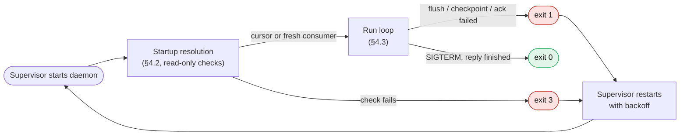
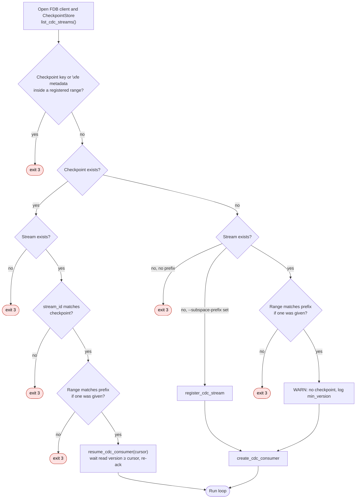
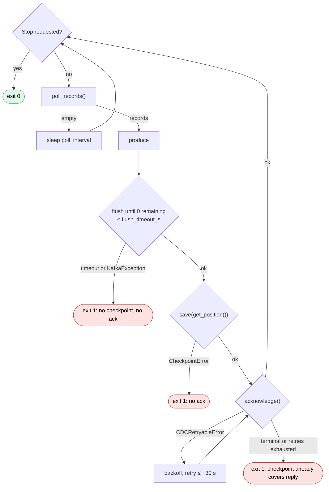

# Checkpoint Spec

> **Draft.** Only §4 (Failover) is written. The other sections land when the
> design is finalized.

Contract for durably checkpointing the CDC cursor in FoundationDB and for the run-loop
ordering that makes restart safe.

Trello: [FoundationDB Commit Version Checkpointing](https://trello.com/c/QmqdoJy5).
Terms: [CDC consumer spec §1](CDC-CONSUMER-SPEC.md#1-scope--rules).
Related: [Daemon Entrypoint & CLI Configuration Runner](https://trello.com/c/5t718fA3),
Wire FDB Listener into Kafka Mutation Producer.

## 1. Guarantees

_Pending._ At-least-once delivery. The checkpoint lives in FDB, and consumers drop
duplicates by `(stream, commit version)`.

## 2. Storage

_Pending._ Covers the directory layer path, key and value encoding, and the overlap guard.

## 3. Write semantics

_Pending._ Covers the read-guard-set transaction, the no-op on an equal version, and
the `CheckpointError` hierarchy.

## 4. Failover

One daemon instance per stream, restarted by its platform supervisor (Docker, k8s,
systemd). Failover is a restart. There is no standby. The supervisor sees only the exit
status; everything else is decided by startup resolution reading FDB.

### 4.1 Restart cycle

### 4.2 Startup resolution

Every exit below is code 3.

### 4.3 Run loop

Every startup check runs before any registration or write. A crash loop on exit 3 is
therefore read-only and leaves no side effects. SIGTERM sets the stop flag, which is
checked only before a poll. A reply that has already been polled runs through ack
before exit 0.

### 4.4 Crash points

What a restart sees when the process dies (crash, SIGKILL, or exit 1) at each step for
reply `R`:

| Dies during / after | Stored checkpoint | Restart resumes from | Effect for `R` |
|---|---|---|---|
| poll or produce | before `R` | before `R` | Re-polled and re-produced. Partial sends are duplicated. |
| flush | before `R` | before `R` | Delivered records are duplicated. |
| checkpoint commit (`commit_unknown_result`) | before or after `R` | whichever committed | Duplicated if it didn't commit, nothing if it did. |
| after checkpoint, before or during ack | after `R` | after `R` | None. Resume re-acks the cursor. |
| after ack | after `R` | after `R` | None. |

No row loses data. The worst case is redelivering one reply's records.

### 4.5 Exit codes

| Code | Meaning | Supervisor |
|---|---|---|
| 0 | Clean shutdown (SIGINT/SIGTERM) | Stays down if stopped intentionally |
| 1 | Runtime failure: flush, checkpoint, or ack | Restart with backoff |
| 2 | Config or usage error | systemd: no restart. Docker/k8s: crash loop |
| 3 | Operator action needed: stream missing, `stream_id` or range mismatch, overlap | systemd: no restart. Docker/k8s: crash loop, alert on the code |

### 4.6 Deployment requirements

- **Kubernetes:** `replicas: 1` and `strategy: Recreate`, or a StatefulSet. Rolling
  updates briefly run two daemons, and both would produce.
  `terminationGracePeriodSeconds ≥ 60` covers the flush deadline plus the ack retry.
- **Docker Compose:** `restart: unless-stopped`, one service, no `scale`.
- **systemd:** `Restart=on-failure`, `RestartPreventExitStatus=2 3`.

The write semantics' backwards-move guard is the only protection against two
concurrent writers. It does not stop duplicate production. Active/passive fencing is
not yet specified.

## 5. Store API

_Pending._ Covers `CheckpointStore` in `src/cdc/checkpoint.py` and `resolve_startup()`
in `src/bridge/`.

## 6. Tests

_Pending._
