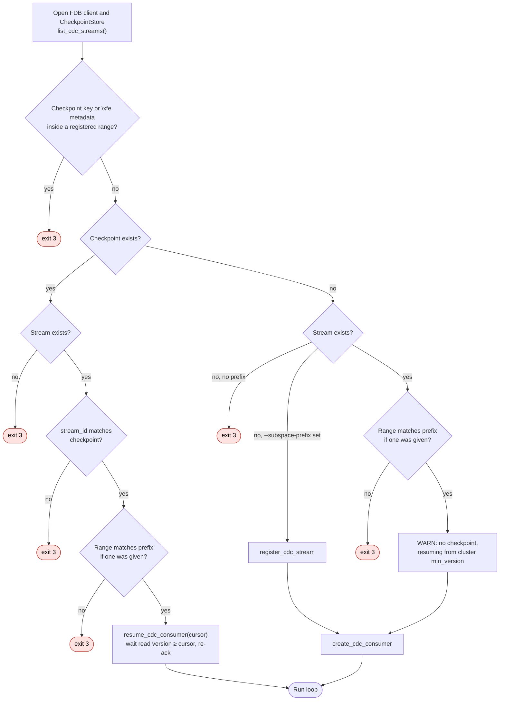

# Checkpoint Spec

Contract for durably checkpointing the CDC cursor in FoundationDB and for the run-loop
ordering that makes restart safe.

Trello: [FoundationDB Commit Version Checkpointing](https://trello.com/c/QmqdoJy5).
Terms: [CDC consumer spec §1](CDC-CONSUMER-SPEC.md#1-scope--rules).
Related: [Daemon Entrypoint & CLI Configuration Runner](https://trello.com/c/5t718fA3),
Wire FDB Listener into Kafka Mutation Producer.

> **Status:** spec only. Implementation waits for PR #18 (the real `MutationProducer`
> with `flush()`) and for the daemon branch to move onto it ("Wire FDB Listener into Kafka
> Mutation Producer", "Daemon Entrypoint & CLI Configuration Runner").

## 1. Guarantees

At-least-once delivery. Consumers drop duplicates by `(stream, commit version)`.

The checkpoint is an identity and integrity guard, not the only record of position.
Every ack advances the stream's `min_version` in the cluster, and a fresh consumer on an
acked stream starts at last ack + 1
([CDC deep dive §1.6](CDC-DEEP-DIVE.md#16-baseline-snapshot-and-handoff-)). The
checkpoint is written before the ack, so it is at most one reply ahead of the cluster.
Losing it costs at most one duplicated reply, never data.

What it adds is detection of a stream that is no longer the one this daemon consumed:

| Hazard | Without a checkpoint | With a checkpoint |
|---|---|---|
| Stream removed and re-registered under the same name | Fresh consumer starts at the new registration. Mutations committed in between are skipped silently. | `stream_id` mismatch, exit 3 |
| Another consumer acked the stream | Fresh consumer starts past the foreign ack. Its replies never reach Kafka. | Resume at the stored cursor fails with `transaction_too_old` instead of skipping silently |

## 2. Storage

- **Location:** a directory-layer directory, opened with `create_or_open` once at startup
  and its prefix cached. The path is configurable, default
  `("fdb-kafka-bridge", "checkpoints")`. The directory layer only provides namespacing;
  durability comes from FDB itself.
- **Key:** `dir.pack((stream_name,))`. The name is known before registration, unlike
  `stream_id`, so startup can find the checkpoint first.
- **Value:** tuple-packed `(format_version, stream_id, last_consumed_version)`, where
  `format_version` is `1`. A decoder rejects any other format version.
- **Overlap guard:** checkpoint writes must never be captured as mutations. At startup,
  if the checkpoint key or the directory-layer metadata (`\xfe`) falls inside any
  registered range of the stream, exit 3. Check `begin_key`/`end_key` now, and `ranges`
  once #13971 lands.

## 3. Write semantics

`save(stream_name, cursor)` is one `@fdb.transactional` function: read the stored
record, apply the guards, then `set`. It is optimistic, not a lock. A concurrent writer
conflicts and the transaction retries.

| Stored record, relative to the new cursor | Result |
|---|---|
| none | `set` |
| same `stream_id`, older version | `set` |
| same `stream_id`, same version | No-op success, no `set`. Makes a retry after `commit_unknown_result` safe. |
| same `stream_id`, newer version | `CheckpointRegressionError(stored, attempted)` |
| different `stream_id` | `CheckpointStreamMismatchError(stored, attempted)` |

Retries use the standard loop with `timeout_s=5` and `retry_limit=10`, both configurable.
Exhausting either raises `CheckpointWriteError`.

`CheckpointError` is the base, separate from `CDCError`, and every subclass is fatal: the
run loop exits 1 without acking (§4.3). The ack has not happened yet, so the cost is
duplicates, never loss.

## 4. Failover

One daemon instance per stream, restarted by its platform supervisor (Docker, k8s,
systemd). Failover is a restart. There is no standby. The supervisor sees only the exit
status; everything else is decided by startup resolution reading FDB.

### 4.1 Restart cycle


### 4.2 Startup resolution

Every exit below is code 3.



### 4.3 Run loop


Every startup check runs before any registration or write. A crash loop on exit 3 is
therefore read-only and leaves no side effects. SIGTERM sets the stop flag, which is
checked only before a poll. A reply that has already been polled runs through ack
before exit 0. On the first consume after start, `client_invalid_operation` is retried
once after ~6 s, because a dead predecessor's proxy consume lease can hold for up to 5 s
([CDC deep dive](CDC-DEEP-DIVE.md)). A second failure exits 1.

### 4.4 Crash points

What a restart sees when the process dies (crash, SIGKILL, or exit 1) at each step for
reply `R`:

| Dies during / after | Stored checkpoint | Restart resumes from | Effect for `R` |
|---|---|---|---|
| poll or produce | before `R` | before `R` | Re-polled and re-produced. Partial sends are duplicated. |
| flush | before `R` | before `R` | Delivered records are duplicated. |
| checkpoint commit (`commit_unknown_result`) | before or after `R` | whichever committed | Duplicated if it didn't commit, nothing if it did. |
| after checkpoint, before or during ack | after `R` | after `R` | None. Resume re-acks the cursor. |
| after ack | after `R` | after `R` | None. |
| — (checkpoint lost or deleted, or directory path changed) | none | last ack + 1 (fresh consumer) | At most one reply duplicated. |

No row loses data. The worst case is redelivering one reply's records.

### 4.5 Exit codes

| Code | Meaning | Supervisor |
|---|---|---|
| 0 | Clean shutdown (SIGINT/SIGTERM) | Stays down if stopped intentionally |
| 1 | Runtime failure: flush, checkpoint, or ack | Restart with backoff |
| 2 | Config or usage error | systemd: no restart. Docker/k8s: crash loop |
| 3 | Operator action needed: stream missing, `stream_id` or range mismatch, overlap | systemd: no restart. Docker/k8s: crash loop, alert on the code |

### 4.6 Deployment requirements

- **Kubernetes:** `replicas: 1` and `strategy: Recreate`, or a StatefulSet. Rolling
  updates briefly run two daemons, and both would produce.
  `terminationGracePeriodSeconds ≥ 60` covers the flush deadline plus the ack retry.
- **Docker Compose:** `restart: unless-stopped`, one service, no `scale`.
- **systemd:** `Restart=on-failure`, `RestartPreventExitStatus=2 3`.

The write semantics' backwards-move guard is the only protection against two
concurrent writers. It does not stop duplicate production. Active/passive fencing is
not yet specified.

## 5. Store API

`src/cdc/checkpoint.py`, exported from `src.cdc`:

```python
class CheckpointStore:
    def __init__(
        self,
        client: FDBClient,
        *,
        path: tuple[str, ...] = ("fdb-kafka-bridge", "checkpoints"),
        timeout_s: float = 5.0,
        retry_limit: int = 10,
    ) -> None: ...
    def open(self) -> None: ...                         # create_or_open, cache prefix
    def key_range(self) -> tuple[bytes, bytes]: ...     # for the overlap guard
    def load(self, stream_name: bytes) -> CdcCursor | None: ...
    def save(self, stream_name: bytes, cursor: CdcCursor) -> None: ...  # §3
    def delete(self, stream_name: bytes) -> None: ...   # operator recovery
```

Whether the binding's native `CdcCursor` can be constructed from Python is still to be
verified. If it can't, `load` returns a dataclass exposing `stream_id` and
`last_consumed_version`, which `FDBClient.resume_cdc_consumer` already validates
(`src/cdc/client.py`).

`resolve_startup(client, store, stream_name, key_range) -> (cursor | None, register)` lives
in `src/bridge/` and runs the §4.2 checks. Its decision core takes plain values
(checkpoint, stream list, configured prefix) so every branch can be unit-tested. The
daemon builds the listener with `cursor=` and passes `key_range` only when `register` is
true. The store is injected as `BridgeDaemon(..., checkpoint_store=)`.

## 6. Tests

| Area | Kind | Location |
|---|---|---|
| Value encode/decode | Unit | `tests/cdc/` |
| §3 guards, deterministic stale writer (save V2 then V1), retry exhaustion via a tiny timeout | Live FDB, throwaway directory per test | `tests/cdc/` |
| §4.3 order, exit codes, SIGTERM mid-reply, first-consume retry | Unit: fake listener, producer and store sharing one call log, failure injected at each step | `tests/bridge/` |
| §4.4 crash points, one case per row | Live FDB: real CDC and store, in-memory producer. A crash is a raise at step N plus abandoning the listener; a second daemon resumes. | `tests/bridge/` |
| §4.2 every branch, plus no write before exit 3 | Unit, with a store fake that records writes | `tests/bridge/` |
| §4.2 overlap, registration idempotent by name, range mismatch | Live FDB | `tests/bridge/` |
| §1 assumptions: fresh consumer starts at last ack + 1; re-registration mints a new `stream_id`; resume after a foreign ack fails with `transaction_too_old` | Live FDB, required | `tests/cdc/` |
| Proxy consume lease holds for ≤ 5 s after an abandoned consume | Live FDB, `xfail(strict=False)` | `tests/cdc/` |

No test mocks FDB transactions. Live tests carry the `integration` marker and are skipped
unless `FDB_CDC_INTEGRATION=1`.

**CI:** a `test-checkpointing` job in `Container-setup.yml` runs
`tests/cdc/test_checkpoint*.py` and `tests/bridge/` inside the `fdb-cdc:ci` image against
its real FDB cluster, the same way `test-cdc-mutations` does.

**Coverage:** `--cov-branch --cov-fail-under=100` on `src/cdc/checkpoint.py`.
`# pragma: no cover` needs a one-line reason. The resolver is reported but not gated
until the daemon lands. If 100% would need a non-deterministic test, the gate drops to
90% and is re-evaluated. A flaky test is never accepted to hold the gate.

**Out of scope:** an end-to-end test with real Kafka and SIGKILL, which needs Kafka in CI.

## 7. Not yet specified

- **Coalesced checkpointing:** checkpoint and ack every N replies or T seconds.
- **Active/passive fencing:** an FDB lease plus an owner token checked in the checkpoint
  transaction, for faster failover on node loss than platform rescheduling. It fences the
  checkpoint, not a zombie daemon's Kafka produce, which needs a transactional producer.
- **Atomic-MAX layout:** store the version under its own key, written with atomic `MAX`, if
  per-reply checkpoint latency is a bottleneck. This gives up the §3 guards.
- **`reset-checkpoint` CLI:** wraps `CheckpointStore.delete()`.
- **Reference deployment configs:** tracked on "Reference Deployment Configs (k8s,
  Compose, systemd)".

## 8. Acceptance criteria

These replace the original criteria on the Trello card. They correct the original's
version-only checkpoint, its "+1" resume, its `\xff` subspace, and its ack-before-checkpoint
order.

- [ ] The checkpoint is the full cursor `(stream_id, last_consumed_version)`, stored per
      §2. Never under `\xff`.
- [ ] Startup exits 3 if the checkpoint key or the directory metadata overlaps the
      stream's range.
- [ ] `save()` follows §3: one optimistic transaction with the equal-version no-op, and
      fatal `CheckpointError` subclasses for regression, `stream_id` mismatch and retry
      exhaustion.
- [ ] The run loop follows §4.3: poll → produce → flush → `save(get_position())` → ack.
      A flush or checkpoint failure exits 1 without acking. The ack retries
      `CDCRetryableError` for ~30 s. SIGTERM finishes the polled reply. The first consume
      retries `client_invalid_operation` once after ~6 s.
- [ ] Startup follows §4.2: resume the stored cursor as-is, with no "+1". A `stream_id`
      mismatch, a missing stream or a range mismatch exits 3 with no prior writes. No
      checkpoint means a WARN and a fresh consumer.
- [ ] `CheckpointStore` and `resolve_startup()` match §5.
- [ ] The tests in §6 run in the `test-checkpointing` CI job inside the FDB container,
      with 100% branch coverage on `checkpoint.py`.
